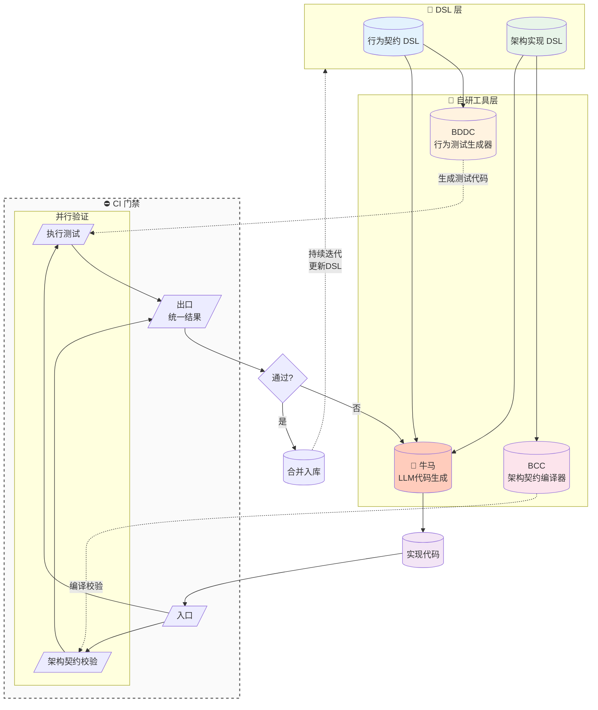

# Cli

> **LLM 时代的软件工程操作系统**：taskctl 编排复杂工作流，BCC 编译代码结构为可验证的知识图谱，niuma 实现从需求到合并的全自动开发，BDDC 执行行为驱动测试。人定义规则和目标，机器处理执行和验证。
>
> 📖 详细哲学阐述见 [`PHILOSOPHY.md`](PHILOSOPHY.md)

## 需求即测试，代码即文档

`需求即测试`：需求必须通过行为契约/DSL直接生成测试代码，需求不是独立于测试的文本描述。

`代码即文档`：代码实现通过架构和实现的契约进入编译器/校验器检查。

代码行为由测试代码验证；结构与约束由契约校验。两条验证链共同形成闭环。

## 文档导航

- BCC：[`compiler/bcc/README.md`](compiler/bcc/README.md)
- BDDC：[`compiler/bddc/README.md`](compiler/bddc/README.md)
- Niuma：[`automation/niuma/README.md`](automation/niuma/README.md)
- Taskctl：[`orchestration/taskctl/README.md`](orchestration/taskctl/README.md)
