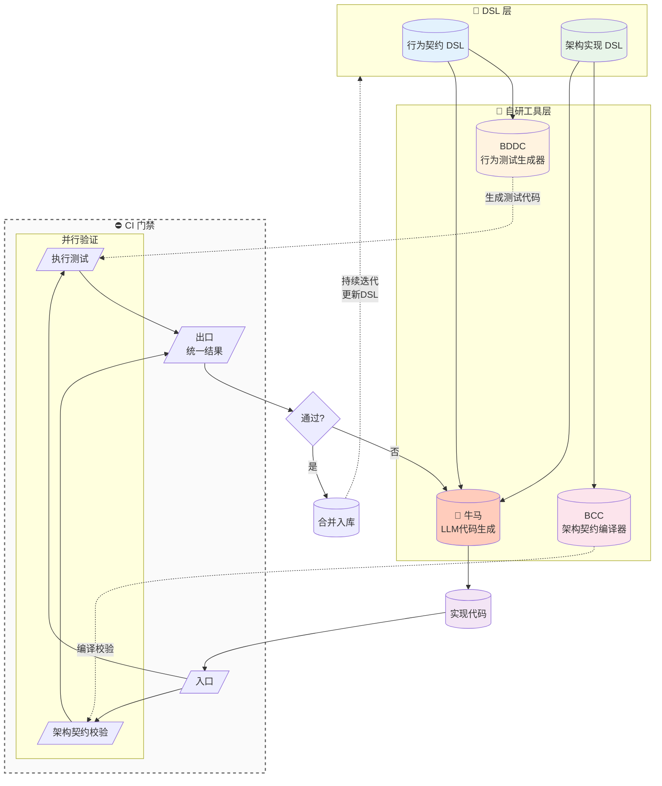

# Cli

> **LLM 时代的软件工程操作系统**：taskctl 编排复杂工作流，BCC 编译代码结构为可验证的知识图谱，niuma 实现从需求到合并的全自动开发，BDDC 执行行为驱动测试。人定义规则和目标，机器处理执行和验证。
>
> 📖 详细哲学阐述见 [`PHILOSOPHY.md`](PHILOSOPHY.md)

## 需求即测试，代码即文档

`需求即测试`：需求必须通过行为契约/DSL直接生成测试代码，需求不是独立于测试的文本描述。

`代码即文档`：代码实现通过架构和实现的契约进入编译器/校验器检查。

代码行为由测试代码验证；结构与约束由契约校验。两条验证链共同形成闭环。

## 工具介绍

- [**BCC（Architecture Compiler）**](compiler/bcc/README.md)：把架构与行为契约编译为可校验工件，覆盖模块层级、分层规则、`flow/boundary/event` 三视图；并产出供 BDDC 生成测试代码的输入。BCC 自身的架构契约校验也是 CI 门禁的一部分。
- [**BDDC（BDD Test Runtime）**](compiler/bddc/README.md)：基于 BCC 输入生成测试代码并执行；测试通过后形成验收结果，作为 CI 门禁结果的一部分。
- [**Niuma（自动化研发引擎）**](automation/niuma/README.md)：单 Issue 流程包含前期讨论收敛与方案定稿，自动推进实现与 PR 迭代；PR review 阶段由人参与决策；同时支持多 Issue DAG 协调。
- [**taskctl（Research/Plan/Execute Orchestration）**](orchestration/taskctl/README.md)：不仅提供执行期 DAG 编排，还支持研究期与/或图建模，用于从研究到执行的统一任务编排。
