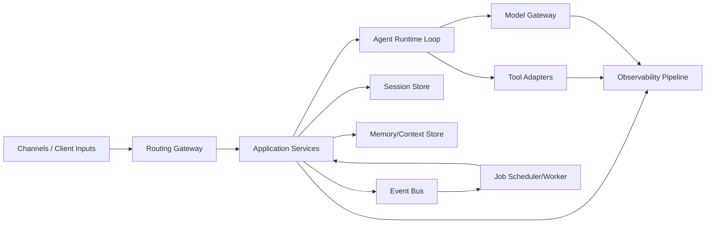
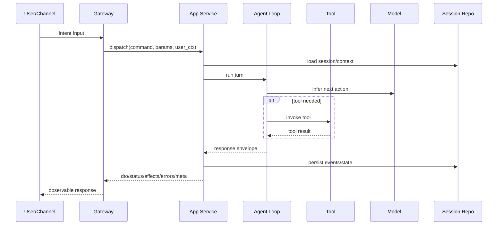
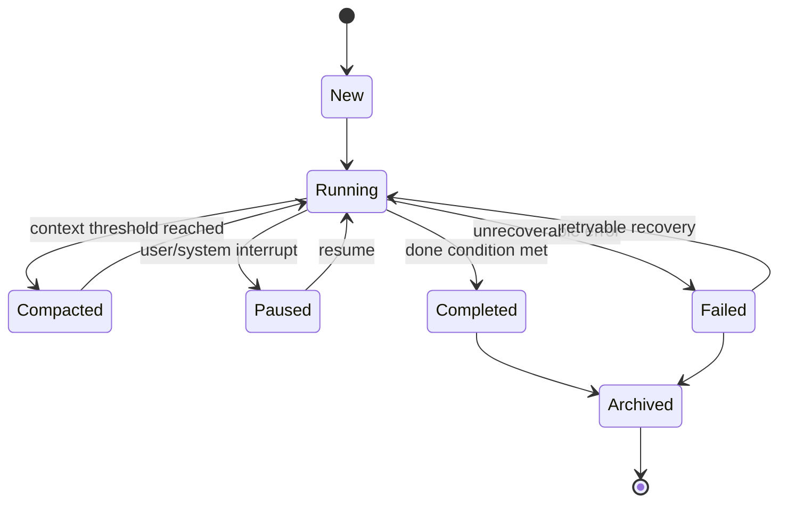

# 技术设计文档：后端编译器（PRD/BDD/DSL/骨架）

说明：本文件承载“可编译链路”设计（PRD -> BDD、技术设计 -> DSL、DSL -> 骨架与门禁），与运行时后端能力文档分离。

## 0.0 命名与边界（先读）
为了避免混淆，先定义边界：
- `stitch`：UI 编译器，输出 BFF API 契约（status/data/events schema + LiveView 骨架），定义前端视角所需的接口规范。
- `bddc`：BDD Compiler，负责把 BDD DSL 编译成 ExUnit 测试代码，对后端各模块及其集成做行为验收。
- 本文的后端编译器（建议缩写 `BCC`，Command 也可约定为 `bcc`）：负责把技术设计/DSL 转成后端代码骨架与生成产物。
- 三者不是替代关系，而是同一软件工厂的不同层。

### 三编译器协作关系

```
┌─────────────────────────────────────────────────────┐
│                    需求/技术设计                       │
└──────────┬────────────────────────┬──────────────────┘
           │                        │
           ▼                        ▼
   ┌──────────────┐        ┌──────────────┐
   │   stitch     │        │     BCC      │
   │  UI 编译器    │        │  后端编译器   │
   │              │        │              │
   │ 输出:        │        │ 输出:        │
   │ · BFF API 契约│        │ · 领域模块骨架│
   │ · Schema     │        │ · 契约测试桩  │
   │ · LiveView   │        │ · bddc DSL   │
   └──────┬───────┘        └──────┬───────┘
          │                       │
          ▼                       │
   ┌──────────────┐               │
   │  薄层 BFF    │◄──────────────┘
   │ (适配/编排层) │
   │              │
   │ 对接 stitch  │
   │ 契约与后端模块│
   └──────┬───────┘
          │
          ▼
   ┌──────────────┐
   │    bddc      │
   │  BDD 编译器   │
   │              │
   │ 验收范围:     │
   │ · 模块单元    │
   │ · 模块集成    │
   │ · BFF 端到端  │
   └──────────────┘
```

**职责边界**：
- `stitch` 只管前端需要什么（BFF 契约），不关心后端怎么实现。
- `BCC` 只管后端模块骨架生成，不关心前端展示。
- 薄层 BFF 是两者的适配胶水，负责把后端领域能力映射到 stitch 定义的 API 契约。
- `bddc` 横切所有层做行为验收，不生成实现代码。

**联通方式（建议默认链路）**：
1. 需求规范分两路：`stitch` 输出 BFF API 契约；技术设计输入 `BCC`。
2. `BCC` 生成后端模块骨架，同时输出 bddc DSL stub（每个 port 的骨架场景）。
3. 开发者在薄层 BFF 中对接 stitch 契约与 BCC 生成的后端模块。
4. `bddc` 对各层做行为验收：
   - `bddc compile`：生成 `test/bdd_generated`。
   - `bddc lint`：静态检查场景质量。
   - `bddc check`：运行生成测试并做 runtime 覆盖门禁。
5. 门禁通过后再进入提交流；未通过阻断 PR 并返回 `scenarioId` 与 `trace_id`。

### BCC → bddc 衔接模式

BCC 生成骨架时**同时输出 bddc DSL stub**，降低手写测试的启动成本：

- 每个 `port`（command/query/event）自动生成一个最小 BDD 场景骨架，使用真实 bddc v1 语法：
  ```bdd
  [SCENARIO: BDD-{MODULE}-{PORT}-001] TITLE: {port} 正常调用应返回预期结构 TAGS: contract {module_tag}
  LET session_id=uuid()
  GIVEN given_{setup_instruction} session_id=$session_id {默认参数}
  WHEN {port_instruction} session_id=$session_id
  THEN assert_{output_instruction} expected_status="ok"
  ```
  以 `SessionService.load_context` 为例，生成的 stub 为：
  ```bdd
  [SCENARIO: BDD-SESSION-001] TITLE: load_context 正常加载会话上下文 TAGS: contract session
  LET session_id=uuid()
  GIVEN given_session_exists session_id=$session_id state="running"
  WHEN load_session_context session_id=$session_id
  THEN assert_session_loaded session_id=$session_id expected_state="running"
  ```
- stub 中的指令名（如 `given_session_exists`、`load_session_context`）需在 bddc 指令规格中注册。BCC 会检查指令是否已注册，未注册的标注 `# TODO: 需在 instructions_v1.exs 中注册` 注释。
- 开发者在 stub 基础上补充业务细节（边界/异常/集成场景）。
- BCC 不覆盖已存在的 DSL 文件（只生成新文件，不修改已有场景）。
- stub 输出路径：`docs/bdd/generated_stubs/`，命名规则 `{module_snake_case}_contract.dsl`。

### 薄层 BFF 归属

薄层 BFF 不由任何编译器自动生成，由开发者手写维护：

- **输入**：stitch 输出的 BFF API 契约（status/data/events schema）+ BCC 输出的后端模块接口。
- **职责**：参数转换、接口编排、错误码映射、鉴权上下文注入。
- **形态**：Phoenix LiveView 模块（当前 stitch 的 LiveView skeleton 已提供基础结构）或 API Controller。
- **测试**：通过 bddc 的集成/E2E 场景覆盖（`WHEN http_get`、`WHEN liveview_mount` 等指令）。
- **原则**：BFF 层只做适配和编排，不包含业务逻辑；业务逻辑归属 BCC 生成的后端模块。

建议脚本形式（示意）：
```bash
bcc compile --in contracts/modules/ --out lib/shop/ --meta contracts/artifacts/meta.json
bddc check \
  --project-root . \
  --in docs/bdd \
  --out test/bdd_generated \
  --instructions priv/bdd/instructions_v1.exs \
  --runtime-module Shop.BDD.Instructions.V1 \
  --exclude-flaky --rerun-failures 1
```

## 0. 背景、目标与原则
### 0.1 背景
- 当前链路中：
  - `stitch` 可产出契约侧前端产物（schema/skeleton/E2E 规范）。
  - `bddc` 可把行为 DSL 编译为可执行测试。
  - 缺口在于后端实现层仍偏手写，缺少稳定可复用的后端骨架生成。

### 0.2 目标
- 建立“需求 -> 契约 -> 测试 -> 后端骨架”一致性链路。
- 让生成器固化工程共性（分层、协议、错误、观测、门禁），不替代业务规则设计。
- 让 `bddc` 作为外圈验收，与契约测试形成内外双环。

### 0.3 非目标
- 不自动生成复杂业务规则本体。
- 不在 v1 解决所有历史系统改造。
- 不绕过代码评审和质量门禁流程。

### 0.4 核心原则
1. 先定最佳实践，再做生成器。
2. 先做最小可执行闭环，再扩展覆盖范围。
3. 生成器只固化共性，不固化业务特性。
4. 所有生成行为必须可观测、可回滚、可审计。

## 1. PRD -> BDD 可编译性评估（当前）
### 1.1 可直接编译的部分
- `Intent` 可转为 Feature 级目标与验收标签（不直接形成单条场景）。
- `Constraints` 可转为全局 Guard Rails（跨场景 Then 约束）。
- 可观测行为契约与证据清单具备直接编译条件。
- 现有能力映射可作为回归套件编排依据。

### 1.2 尚不能全量自动编译的部分
- 叙述性需求缺少统一场景元数据：
  - `requirementId`
  - `actor/precondition/trigger`
  - `observable_evidence`
  - `pass_fail_rule`
- 同一需求缺“正向/异常/边界”标准拆分规则。

### 1.3 结论
- 当前可先生成高价值 BDD（优先可观测契约与核心闭环）。
- 若目标是“PRD 即测试（全量）”，需先补齐可编译场景结构。

## 2. 技术设计 -> DSL -> 后端骨架 可编译性评估
### 2.1 结论
- 现有技术设计可升级为可执行 DSL。
- DSL 驱动“骨架生成 + 契约测试生成”，不生成复杂业务规则本体。

### 2.2 DSL 最小元素
- `module`：模块名、层级、职责、状态 owner。
- `port`：`command/query/event`、输入输出 schema、错误契约。
- `relation`：依赖方向、同步/异步、允许/禁止。
- `invariant`：跨模块强约束（幂等、重试、事务、停止语义）。
- `traceability`：`requirementId -> module.port -> bddScenarioId`。

### 2.2.1 BCC DSL 文件格式（v0）

BCC DSL 采用 YAML 格式，每个文件描述一个模块及其端口。选择 YAML 而非自定义语法，是因为：结构化数据表达力足够、工具链成熟、学习成本低。

最小示例（`contracts/modules/session_service.yaml`）：

```yaml
module:
  name: SessionService
  layer: application
  owner: session_team
  responsibility: 会话生命周期管理

ports:
  - name: load_context
    kind: query
    input:
      session_id: uuid
    output:
      session_id: uuid
      state: string
      entries: list
    errors: [SESSION-IO-001, SESSION-STATE-001]
    timeout_ms: 1500

  - name: persist_turn
    kind: command
    input:
      session_id: uuid
      turn_data: map
    output:
      ack: boolean
    errors: [SESSION-IO-001]
    timeout_ms: 2000

relations:
  - callee: CompactionService
    mode: sync
    transaction_boundary: caller
  - callee: EventBusPort
    mode: async

invariants:
  - persist_turn 必须幂等（相同 turn_id 重复调用不产生副作用）
  - load_context 超时不可阻塞调用方主线程

traceability:
  - requirement: "6.1 会话生命周期"
    ports: [load_context, persist_turn]
    bdd_scenarios: [BDD-SESSION-001, BDD-SESSION-002]
```

字段约束：

| 字段路径 | 必填 | 类型/可选值 | 说明 |
|----------|------|------------|------|
| `module.name` | Y | string | 模块名（PascalCase） |
| `module.layer` | Y | `domain` / `application` / `infrastructure` | 分层归属 |
| `module.owner` | N | string | 负责团队/人 |
| `module.responsibility` | N | string | 一句话职责说明 |
| `ports[].name` | Y | string | 端口名（snake_case） |
| `ports[].kind` | Y | `command` / `query` / `event` | 端口类型 |
| `ports[].input` | Y | map of `{field: type}` | 输入 schema |
| `ports[].output` | Y | map of `{field: type}` | 输出 schema |
| `ports[].errors` | N | list of string | 错误码列表（`{MODULE}-{CATEGORY}-{SEQ}`） |
| `ports[].timeout_ms` | N | integer | 超时毫秒数，默认 5000 |
| `relations[]` | N | list | 为空表示无外部依赖 |
| `relations[].callee` | Y | string | 被调模块名 |
| `relations[].mode` | Y | `sync` / `async` | 调用模式 |
| `relations[].transaction_boundary` | N | `caller` / `callee` / `none` | 事务归属 |
| `invariants[]` | N | list of string | 自由文本约束描述 |
| `traceability[]` | N | list | 需求追踪映射 |

schema 中 `input`/`output` 的字段类型枚举：`string` / `uuid` / `integer` / `decimal` / `boolean` / `datetime` / `date` / `map` / `list` / `enum(v1,v2,...)` 。

文件组织约定：
- 目录：`contracts/modules/`，每个模块一个文件。
- 索引：`contracts/manifest.toml` 注册所有模块文件及校验和。
- 产物：`contracts/artifacts/` 存放生成的追踪/覆盖工件（只读）。

### 2.2.2 从零编写 YAML（模板 + 指南）

**场景**：新模块，还没有代码。

`bcc init <module_name>` 生成空模板：

```bash
$ bcc init order_service
  Created: contracts/modules/order_service.yaml
```

生成的模板（带注释引导）：

```yaml
# BCC 模块描述文件 — 请根据实际设计填写
# 文档：Cli/compiler/bcc/docs/技术设计文档-后端编译器.md §2.2.1

module:
  name: OrderService              # PascalCase 模块名
  layer: application              # domain / application / infrastructure
  owner: ""                       # 负责团队（可选）
  responsibility: ""              # 一句话职责说明（可选）

ports:
  # 每个 port 是模块对外暴露的一个操作
  - name: create_order            # snake_case
    kind: command                 # command（写）/ query（读）
    input:
      # 参数名: 类型（uuid / string / integer / boolean / map / list）
      user_id: uuid
      items: list
    output:
      order_id: uuid
    errors: []                    # 错误码列表，如 [ORDER-CREATE-001]
    timeout_ms: 3000              # 超时毫秒（可选）

relations: []
  # - callee: PaymentService
  #   mode: sync                  # sync / async
  #   transaction_boundary: caller  # caller / callee / none

invariants: []
  # - "create_order 必须幂等"

traceability: []
  # - requirement: "需求章节号"
  #   ports: [create_order]
  #   bdd_scenarios: [BDD-ORDER-001]
```

编写要点：
- **先写 ports**：每个 port 对应一个用例/API，是模块的核心契约。
- **input/output 用简单类型**：`uuid`/`string`/`integer`/`boolean`/`map`/`list`，不引用内部 struct。
- **errors 用错误码前缀**：`{MODULE}-{PORT}-{SEQ}`，如 `ORDER-CREATE-001`。
- **invariants 用自然语言**：描述不变量约束，BCC 会生成对应的 guard clause 注释。
- **traceability 可后补**：先写 ports，稳定后再补需求追踪和 BDD 场景关联。

### 2.2.3 从已有代码提取（多语言）

**场景**：已有后端代码（Elixir/Go/Rust/PHP/TypeScript 等），想反向提取模块结构。

#### 架构：tree-sitter 统一提取

已有的提取脚本各用各自语言的专用解析器：

| 现有原型 | 目标语言 | 解析方式 | 局限 |
|----------|---------|---------|------|
| `upfit/scripts/audit_actions.php` | PHP | `token_get_all()` | 只能跑在 PHP 环境 |
| `bcc/scripts/audit-backend-ast.ts` | TypeScript | `ts` 编译器 API | 只能解析 TS/JS |

BCC 统一为 **tree-sitter** 驱动的多语言提取：

```
源码（任意语言）
    │
    ▼
tree-sitter + 语言 grammar
    │
    ▼
CST（具体语法树）
    │
    ▼
语言专属 tree-sitter query（.scm）
    │
    ▼
统一 FileRecord
    │
    ├──► YAML draft（供 bcc compile）
    └──► 分析文档（per-file markdown）
```

tree-sitter 的 Rust binding 直接集成到 BCC binary，无外部依赖。grammar 作为编译时资源嵌入。

#### 统一提取模型（FileRecord）

无论源码是什么语言，提取结果统一为 `FileRecord`：

```rust
struct FileRecord {
    language: String,            // "elixir" | "typescript" | "tsx" | ...
    file_path: String,
    loc_lines: usize,            // 源码总行数
    declarations: usize,         // 声明总数（def/defp/class/function 等）
    // 结构提取
    imports: Vec<ImportRecord>,  // 依赖引入（alias/import/use）
    exports: Vec<ExportRecord>,  // 公开接口（def/export function 等）
    calls: Vec<CallRecord>,     // 模块级调用（Module.func）
    // 行为分类：副作用标签
    side_effects: SideEffects,  // 全文关键词扫描得出的行为分类标签
    // 文档
    module_doc: Option<String>, // 模块级文档注释（@moduledoc / JSDoc）
}
```

> **副作用检测的定位**：`side_effects` 是行为检测的一个分类维度，标注模块"做了什么类型的外部交互"（并发/网络/状态/IO/消息）。当前实现用全文关键词扫描（`content.contains("Task.async")` 等），而非 tree-sitter AST 级检测。理论上可以从 `calls` + `imports` 推导（如 calls 含 `HTTPoison` → `has_http`），但全文扫描能捕获 `use GenServer` 等非 dot-call 模式，且成本极低，故保持独立扫描。

#### 语言专属提取规则

| 语言 | 公开函数 | 类型签名 | 错误模式 | 模块调用 | 模块文档 |
|------|---------|---------|---------|---------|---------|
| **Elixir** | `def` (忽略 `defp`) | `@spec` | `{:error, atom}` | `Module.func()` | `@moduledoc` |
| **Go** | 大写开头函数 | 函数签名 | `error` 返回值 | `pkg.Func()` | `// Package` 注释 |
| **Rust** | `pub fn` | 返回类型 | `Result<T, E>` | `crate::mod::func()` | `//!` 文档注释 |
| **PHP** | `public function` | PHPDoc `@param/@return` | `throw` / `return false` | `Class::method()` | `/** */` 类注释 |
| **TypeScript** | `export function/class` | TS 类型标注 | `throw` / `Promise.reject` | `import {x} from` | JSDoc |

每种语言的提取规则用 tree-sitter query（`.scm` 文件）实现，新增语言只需添加对应的 grammar + query 文件。

#### 用法示例

```bash
# 提取单个 Elixir 文件 → YAML
$ bcc extract lib/shop/order/order_service.ex
  Extracted: contracts/modules/order_service.yaml (draft)
  Found: 3 ports, 5 errors, 2 relations

# 提取 PHP 控制器目录 → 批量分析
$ bcc extract --lang php app/controllers/ --output audit/
  Scanned: 142 files, 891 public methods
  Output: audit/file-records.json + audit/coverage.tsv

# 提取 Go 项目
$ bcc extract --lang go internal/service/
  Scanned: 38 files, 127 exported functions
  Output: contracts/modules/*.yaml (draft)

# AST 结构概览（不生成 YAML，只输出统计）
$ bcc extract --mode ast-summary src/
  Files: 1685, Functions: 4231, Async: 312, Network: 89
```

#### 提取输出与文档模板的关系

extract 是结构提取工具，负责从代码中用 tree-sitter 提取确定性的事实（函数签名、调用关系、副作用等）。但最终交付物——严格遵循模板的 **per-file 分析文档**——由 **Agent（LLM）** 生成，extract 的输出作为 agent 的输入之一。

#### 两阶段分工：extract（确定性提取） + agent（语义理解）

| 模板章节 | 填充方 | 数据来源 | 说明 |
|----------|:------:|---------|------|
| **职责** | extract + agent | `module_doc` + agent 读源码 | extract 提取文档注释；agent 补充/修正 |
| **行为意图** | **agent** | agent 读源码 + 上下文 | 业务目的、为什么存在——需要语义理解 |
| **行为** | extract + agent | `exports` 签名 + agent 读函数体 | extract 列函数骨架；agent 补流程/时序/分支描述 |
| **约束** | **agent** | agent 读源码中的校验/guard/权限逻辑 | 权限、失败边界、安全边界——需理解业务上下文 |
| **输入输出** | extract | `exports` 类型签名 + 错误模式 | 从 @spec / 类型标注 / PHPDoc 提取 |
| **调用链位置** | extract | `imports` → 上游；`calls` → 下游 | 精确到模块/文件级 |
| **状态与副作用** | extract | `side_effects`（async/网络/GenServer/文件 IO/PubSub） | 全文关键词扫描分类标签（行为检测的分类维度） |
| **异常处理** | extract + agent | 错误模式 + agent 读 catch/rescue 逻辑 | extract 列异常来源；agent 补处理策略 |
| **PRD 映射** | **agent** | agent 结合 PRD 文档 + 源码语义 | 需要跨文档关联能力 |
| **溯源证据** | extract | `source_path` + 日期 + 关键函数名 | 全自动 |

#### 工作流（三步）

```
步骤 1: bcc extract（确定性提取）
    源码 ──► tree-sitter ──► FileRecord（JSON）
    提取：函数签名、调用关系、副作用分类标签、文档注释

步骤 2: Agent 生成文档（语义理解）
    输入：FileRecord + 源码原文 + PRD 文档 + 模板
    输出：完整的 per-file 分析文档（所有 9 个章节）
    Agent 做的事：
    - 读 FileRecord 中的结构数据 → 直接填入输入输出/调用链/副作用
    - 读源码原文 → 理解行为意图、约束、异常处理策略
    - 关联 PRD 文档 → 填写 PRD 映射标签

步骤 3: bcc trace（质量审计）
    检查生成的文档是否章节齐全、非空
    报告缺口 → 触发 agent 补写
```

**Agent 调用 extract 的方式**：
```bash
# Agent 先调 extract 拿结构数据
$ bcc extract --mode ast src/gateway/router.ts
  → stdout: FileRecord JSON

# Agent 读 JSON + 读源码 + 读 PRD → 生成完整文档
# （Agent 内部逻辑，不是 bcc 命令）

# 最后 trace 审计
$ bcc trace status src/ docs/backend-trace/files/
```

`bcc extract --mode doc` 也可以直接生成文档草稿（只填 extract 能填的章节，语义章节留 `<!-- TODO: agent 补写 -->`），适合 agent 不可用时的降级场景。但正常流程是 agent 拿 `--mode ast` 的 JSON 输出，自己生成完整文档。

三种输出模式：

1. **分析文档**（`--mode doc`，主要用途）：按模板生成 per-file markdown，自动填充能填的章节，人工章节留 `<!-- TODO -->` 标记。
2. **YAML draft**（`--mode yaml`）：生成 BCC 可编译的 YAML 初稿，标记为 `# [EXTRACTED — 需人工确认]`。
3. **AST JSON**（`--mode ast`）：输出结构化 `FileRecord` JSON，供程序消费（对接审计脚本、覆盖率报表等）。

### 2.2.4 文档覆盖审计（trace）

配合 `extract` 的文档审计功能，检查源码与分析文档的对齐。trace 的核心职责是：**模板里 9 个必须章节，哪些文件缺了哪些章节？**

```bash
# 覆盖状态概览
$ bcc trace status src/ docs/backend-trace/files/
  总文件: 1685, 已有文档: 832, 缺口: 853
  章节缺口: 行为意图 45 / 行为 23 / 约束 67

# 输出审计产物
$ bcc trace report --output docs/backend-trace/artifacts/
  → backend-docs-audit.md       # 齐套性表（按文件列缺失章节）
  → backend-docs-audit-missing.tsv  # 机器可读缺口清单

# 为缺口文件批量创建草稿（调用 extract --mode doc）
$ bcc trace seed --write --max=50
  Created: 50 draft docs in docs/backend-trace/files/
  （自动填充可填章节，人工章节留 TODO）
```

**extract / agent / trace 三者分工**：

```
extract（工具）       agent（LLM）           trace（工具）
确定性结构提取        语义理解 + 文档生成     质量审计
    │                     │                     │
    │  FileRecord JSON    │                     │
    ├────────────────────►│                     │
    │                     │  完整分析文档        │
    │                     ├────────────────────►│
    │                     │                     │  缺口报告
    │                     │◄────────────────────┤
    │                     │  补写缺失章节        │
    │                     ├────────────────────►│
```

- `bcc extract`：从源码提取结构数据（tree-sitter），输出 FileRecord JSON — **纯工具，不做语义判断**
- **Agent**：读 FileRecord + 源码 + PRD → 生成完整分析文档（填所有 9 个章节）— **语义理解的核心**
- `bcc trace`：检查文档章节完整性 → 报告缺口 → 触发 agent 补写 — **纯工具，只查有没有**

审计检查的必须章节（对应 `backend-file-analysis-template.md`）：
- 职责、行为意图、行为、约束、输入输出、调用链位置、状态与副作用、异常处理、PRD 映射

trace 只做"有没有"的检查（章节标题存在且非空），不判断内容质量——内容质量由 agent + 人工 review 把控。

### 2.3 对生成器的价值
- 生成 `Application Service`/adapter/dispatch 骨架。
- 生成契约测试骨架（接口字段、错误码、日志字段、追踪键）。
- 生成依赖违规检查（越层调用、绕过状态写入）。

## 3. DSL 与 UML 的关系
- UML 是可视化表达；DSL 是可执行规范。
- 推荐：DSL 作为真相源，自动导出 UML（组件图/时序图/状态图）。

## 4. 当前未定事项（待决策）
1. DSL 编排粒度：仅架构契约，还是包含复杂业务编排语义。
2. 模块关系约束粒度：仅允许调用，还是加入禁止调用与边界标签。
3. BDD 首批覆盖范围：先可观测+核心闭环，还是一次性全覆盖。
4. 错误码/日志治理：集中注册还是分散维护。
5. 复杂度分流标准：何时必须下沉 Domain 纯函数。

## 5. 未定事项下的推进策略
### 5.1 可先做
1. 固化 `requirementId -> bddScenarioId -> module.port` 追踪映射。
2. 固化可观测契约的 BDD 编译模板。
3. 固化 DSL 最小结构（module/port/relation/invariant/traceability）。
4. 固化最小骨架产物（dispatch + adapter + contract-tests）。

### 5.2 暂缓做
1. 复杂业务规则 DSL 化。
2. 全量自动代码生成（跨模块编排策略引擎）。
3. 全覆盖需求条目的自动场景拆分。

## 6. 三层分离原则（已达成共识）
- 业务规则：归属产品/业务文档与服务层实现。
- DSL：只承载可编译契约（数据契约、接口、关系、约束、追踪映射）。
- BDD：作为业务规则实现的验收兜底。

## 7. 架构覆盖结论与剩余缺口
- 除业务规则本体外，编译链路设计已覆盖主干。
- v0 仍需补齐 3 个可执行清单：
  1. `Port Catalog`
  2. `Relation Matrix`
  3. `Data Alignment Map`

### 7.1 Port Catalog（v0）
| module | port | kind | input_schema | output_schema | error_codes | timeout_ms | owner |
|---|---|---|---|---|---|---:|---|
| `RoutingGateway` | `dispatch_intent` | `command` | `IntentDispatchInput` | `DispatchEnvelope` | `SESSION-STATE-001`, `MODEL-AUTH-001` | 8000 | `RoutingGateway` |
| `SessionService` | `load_context` | `query` | `SessionLoadInput` | `SessionContextDTO` | `SESSION-IO-001`, `SESSION-STATE-001` | 1500 | `SessionService` |
| `SessionService` | `persist_turn` | `command` | `TurnPersistInput` | `PersistAck` | `SESSION-IO-001` | 2000 | `SessionService` |
| `AgentOrchestrator` | `run_turn` | `command` | `TurnRunInput` | `TurnResultEnvelope` | `MODEL-TIMEOUT-001`, `TOOL-TIMEOUT-001` | 10000 | `AgentOrchestrator` |
| `ModelGateway` | `infer_next_action` | `command` | `ModelInferInput` | `ModelDecisionDTO` | `MODEL-AUTH-001`, `MODEL-NETWORK-001`, `MODEL-TIMEOUT-001` | 8000 | `ModelGateway` |
| `ToolAdapter` | `invoke_tool` | `command` | `ToolInvokeInput` | `ToolInvokeResult` | `TOOL-VALIDATION-001`, `TOOL-TIMEOUT-001`, `TOOL-IO-001` | 5000 | `ToolAdapter` |
| `CompactionService` | `compact_context` | `command` | `CompactionInput` | `CompactionResultDTO` | `SESSION-STATE-001` | 3000 | `CompactionService` |
| `EventBusPort` | `publish_event` | `event` | `DomainEventEnvelope` | `PublishAck` | `RESOURCE-CONFLICT-001` | 1000 | `EventBusPort` |
| `JobScheduler` | `enqueue_job` | `command` | `JobEnqueueInput` | `JobEnqueueAck` | `PODS-STATE-001` | 1000 | `JobScheduler` |
| `ObservabilityPort` | `report_trace` | `command` | `TraceReportInput` | `ReportAck` | `RESOURCE-CONFLICT-001` | 800 | `ObservabilityPort` |

### 7.2 Relation Matrix（v0）
| caller | callee | allowed | mode | transaction_boundary | state_owner | notes |
|---|---|---|---|---|---|---|
| `RoutingGateway` | `SessionService` | `Y` | `sync` | `caller` | `SessionService` | 入站先定位会话 |
| `RoutingGateway` | `AgentOrchestrator` | `Y` | `sync` | `none` | `AgentOrchestrator` | 执行单轮编排 |
| `AgentOrchestrator` | `ModelGateway` | `Y` | `sync` | `none` | `ModelGateway` | 模型推理 |
| `AgentOrchestrator` | `ToolAdapter` | `Y` | `sync` | `none` | `ToolAdapter` | 按决策调工具 |
| `AgentOrchestrator` | `SessionService` | `Y` | `sync` | `caller` | `SessionService` | 回写增量状态 |
| `SessionService` | `CompactionService` | `Y` | `sync` | `caller` | `SessionService` | 阈值触发压缩 |
| `SessionService` | `EventBusPort` | `Y` | `async` | `none` | `EventBusPort` | 发布领域事件 |
| `EventBusPort` | `JobScheduler` | `Y` | `async` | `none` | `JobScheduler` | 事件触发异步任务 |
| `ToolAdapter` | `SessionService` | `N` | `-` | `-` | `-` | 禁止工具层直接写会话 |
| `ModelGateway` | `SessionService` | `N` | `-` | `-` | `-` | 禁止模型层直接写会话 |
| `EventBusPort` | `SessionService` | `N` | `-` | `-` | `-` | 订阅处理需经应用服务 |
| `JobScheduler` | `SessionService` | `Y` | `sync` | `caller` | `SessionService` | 作业执行回写会话 |

### 7.3 Data Alignment Map（v0）
| requirement_ref | domain_field | dto_or_status_field | evidence_field | payload_mode | transform_reason | owner_module |
|---|---|---|---|---|---|---|
| `6.1 会话生命周期` | `session.id` | `dto.sessionId` | `log.sessionId` | `passthrough` | `-` | `SessionService` |
| `6.1 会话生命周期` | `session.state` | `status.sessionState` | `event.session_state_changed` | `transform` | `semantic` | `SessionService` |
| `6.2 Agent 执行循环` | `turn.id` | `dto.turnId` | `log.turnId` | `passthrough` | `-` | `AgentOrchestrator` |
| `6.2 Agent 执行循环` | `stop.reason` | `status.stopReason` | `log.stopReason` | `transform` | `boundary` | `AgentOrchestrator` |
| `6.3 工具调用能力` | `tool.call_id` | `dto.toolCallId` | `log.toolCallId` | `passthrough` | `-` | `ToolAdapter` |
| `6.3 工具调用能力` | `tool.error` | `errors[*].code` | `log.errorCode` | `transform` | `semantic` | `ToolAdapter` |
| `6.4 截断与压缩` | `compaction.anchor_id` | `meta.lastStableEntryId` | `log.lastStableEntryId` | `transform` | `boundary` | `CompactionService` |
| `6.5 分支与历史` | `branch.id` | `dto.branchId` | `log.branchId` | `passthrough` | `-` | `SessionService` |
| `6.6 模型与配置` | `model.provider` | `meta.provider` | `log.provider` | `passthrough` | `-` | `ModelGateway` |
| `6.8 可观测性` | `trace.id` | `meta.traceId` | `log.traceId` | `passthrough` | `-` | `ObservabilityPort` |
| `6.8 可观测性` | `retry.final_action` | `status.finalAction` | `log.finalAction` | `transform` | `semantic` | `AgentOrchestrator` |

## 8. 并行开发与集成策略（先定集成，再分工）
- 先冻结契约，再并行开发，可显著降低集成成本。
- 并行前冻结：Port Catalog / Relation Matrix / Data Alignment Map / Traceability。
- 合并门禁先跑契约测试，再跑场景测试。
- 接口变更必须先改契约，再改实现。

## 9. 跨项目对照（OpenClaw -> Pi）
> OpenClaw 和 Pi 是两个开源 AI Agent 项目，此处作为跨项目架构设计参考。Port Catalog / Relation Matrix / UML 等示例均基于 Agent 域，用于演示 BCC DSL 元素的表达能力，不代表 BCC 仅服务于 Agent 场景。

- 借鉴点：证据工件化、风险表达工程化、分层边界清晰。
- Pi 仍需增强：
  - `docs/backend-trace/artifacts/*.tsv` 标准输出
  - `fail-open/fail-closed` 策略矩阵
  - 写入失败不可静默与扩展供应链审计门禁

## 10. OpenClaw 设计评估与 UML 落地
### 10.1 组件图（Component）


### 10.2 时序图（Intent -> 执行 -> 回写）


### 10.3 状态图（会话生命周期）


### 10.4 UML -> DSL -> 骨架映射
- Component 节点 -> `module`
- 接口箭头 -> `port`
- 调用方向 -> `relation`
- 状态转移条件 -> `invariant`
- 时序关键节点 -> `bddScenarioId`

## 11. 数据转换治理（防止过度转换）
### 11.1 总原则
- 默认不转换（passthrough-first）。
- 仅在语义变化/安全脱敏/版本兼容/边界隔离时转换。

### 11.2 转换四问闸门
1. 语义是否变化？
2. 不转换是否会导致错误？
3. 转换责任是否在边界层？
4. 是否有测试证据？

### 11.3 转换预算
- 每条主链路默认最多 2 次转换：
  1. Ingress -> Domain Command
  2. Domain Result -> Egress DTO
- 超预算必须给书面理由并附测试证据。

### 11.4 DSL 与 CI 约束
- `port` 增加：`payload_mode` + `transform_reason`。
- CI 检查：超预算、缺 reason、无语义变化转换、契约/BDD 映射缺失。

## 12. 最佳实践沉淀机制
- 把反复问题沉淀为：文档规则 + DSL 约束 + 测试断言 + CI 门禁。
- 固定流程：问题归类 -> 原则提炼 -> 规则落地 -> 证据化 -> 门禁化。

## 13. 编译器架构（AST + Pass Pipeline）

BCC 采用 **Rust 主体 + Elixir 序列化** 的双端编译器架构。

### 13.0 技术选型：为什么用 Rust 而不是纯 Elixir

BCC 的核心工作是 AST 构造 + pass pipeline 变换。两种语言都能做，选 Rust 的理由：

| 维度 | Rust | Elixir |
|------|------|--------|
| Pass 安全性 | `match` 穷尽匹配——新增 AST 节点类型时编译器强制每个 pass 都处理 | 动态 pattern match——漏掉走兜底分支，运行时才暴露 |
| YAML 校验 | serde 声明式反序列化 + 类型约束，编译期保证 schema | yaml_elixir 解析后需手写校验逻辑 |
| CLI 工具链 | 与 taskctl 统一（clap/serde/错误处理），单 binary 分发 | 需 escript 打包或 Mix task，启动慢 |
| AST 序列化 | 不擅长——Elixir 语法细节多，自己写 emitter 易出错 | **原生优势**——`Macro.to_string` + `Code.format_string!` |

**结论**：重活（解析/校验/AST 构造/pass 变换）用 Rust 的类型系统保护；轻活（AST→源码序列化）委托给 Elixir 标准库。BCC 的运行环境一定是 Elixir 项目，Elixir runtime 始终可用，不构成额外依赖。

### 13.1 编译流水线（Rust + Elixir 双端协作）

```
                    Rust 侧                              │  Elixir 侧
                                                         │
YAML ──► serde ──► 规则校验 ──► Quoted AST ──► Passes ──►│──► Macro.to_string ──► Code.format_string! ──► .ex
 │          │          │            │             │       │         │                      │
 │      ModuleSpec   违规报错   三元组 AST    注入最佳实践 │    AST→源码字符串         官方格式化
 │     (Rust struct)           (JSON 传输)   (可组合/可测) │    (Elixir 原生)          (mix format)
```

**核心设计**：Rust 负责 YAML 解析、校验、AST 构造和 pass 变换；Elixir 负责 AST→源码序列化。利用 Elixir 自身的 `Macro.to_string/1` + `Code.format_string!/1` 保证输出语法正确性和格式规范。

**为什么需要 AST 而不是字符串模板**：最佳实践（envelope、trace、error_code、guard_rails）作为独立 pass 注入 AST，每个 pass 可独立测试、可组合、可开关。字符串模板无法做到 pass 间正交组合。

### 13.2 复用 Elixir 原生 Quoted AST

Elixir 的 AST 是三元组 `{name, metadata, args}`，本身就是普通数据结构（atom + tuple + list），可直接用 JSON 表示并在 Rust/Elixir 间传递。

Elixir 端示例——AST 与源码双向转换：
```elixir
# 源码 → AST
ast = quote do
  def hello(name), do: "hi " <> name
end
# => {:def, [line: 1], [{:hello, [], [{:name, [], nil}]}, [do: {:<<>>, ...}]]}

# AST → 源码
Macro.to_string(ast)
# => "def hello(name), do: \"hi \" <> name"

# 格式化
Code.format_string!(source_string)
```

Rust 侧对应的 AST 表示（映射 Elixir 三元组）：
```rust
/// 映射 Elixir quoted AST 的三元组结构
#[derive(Serialize)]
enum QuotedAST {
    /// {atom, meta, args} — Elixir AST 基本节点
    Call { name: String, meta: Vec<(String, Value)>, args: Vec<QuotedAST> },
    /// {:__aliases__, meta, segments} — 模块名
    Aliases { segments: Vec<String> },
    Atom(String),
    String(String),
    Int(i64),
    List(Vec<QuotedAST>),
    Tuple(Vec<QuotedAST>),
    Map(Vec<(QuotedAST, QuotedAST)>),
    /// {:__block__, [], exprs} — 代码块
    Block(Vec<QuotedAST>),
}
```

**四个库的分工**：
- **serde**（Rust crate）：YAML → `ModuleSpec` struct（输入侧解析）
- **QuotedAST**（自定义 Rust enum）：构造 Elixir 三元组 AST + pass 变换（中间表示）
- **Macro.to_string + Code.format_string!**（Elixir 标准库）：AST → 格式化 `.ex` 源码（输出侧序列化）
- **tree-sitter**（Rust crate）：双重用途——
  - **extract 命令**（核心）：解析多语言源码（Elixir/Go/Rust/PHP/TypeScript），提取结构信息到统一 `FileRecord`
  - **compile 命令**（可选）：对生成的 `.ex` 做语法验证

tree-sitter grammar 清单（按需嵌入）：
| crate | 用于 | 提取内容 |
|-------|------|---------|
| `tree-sitter-elixir` | extract + verify | def/defp、@spec、@moduledoc、模块调用 |
| `tree-sitter-go` | extract | 大写函数、接口、error 返回 |
| `tree-sitter-rust` | extract | pub fn、impl、Result 返回 |
| `tree-sitter-php` | extract | public function、class、PHPDoc |
| `tree-sitter-typescript` | extract | export function/class、import、类型标注 |

### 13.3 AST Pass Pipeline

每个 pass 是 `fn(Vec<QuotedAST>) -> Vec<QuotedAST>` 的纯函数变换，可独立启用/禁用/测试：

| Pass | 职责 | 注入内容 |
|------|------|----------|
| `envelope_pass` | 统一返回结构 | 将裸返回值包装为 `{:ok, %Envelope{}}` / `{:error, %Envelope{}}` |
| `trace_pass` | 链路追踪 | 在函数入口注入 `trace_id = Trace.start(...)` + 出口 `Trace.finish(...)` |
| `error_code_pass` | 错误码规范 | 替换裸 `{:error, reason}` 为 `{:error, %ErrorCode{code: ..., message: ...}}` |
| `guard_rails_pass` | 防御性约束 | 注入参数校验 guard clause + 白名单字段检查 |
| `logging_pass` | 结构化日志 | 在关键路径注入 `Logger.info/warning` 调用 |
| `idempotency_pass` | 幂等保护 | 对写操作注入幂等 key 检查逻辑 |

Pass 执行顺序：
```rust
fn compile(spec: &ModuleSpec, config: &CompileConfig) -> Vec<QuotedAST> {
    let ast = build_skeleton(spec);           // 裸骨架（Elixir 三元组）
    let ast = envelope_pass(ast, spec);       // 必选：统一返回结构
    let ast = error_code_pass(ast, spec);     // 必选：错误码规范
    let ast = if config.trace { trace_pass(ast, spec) } else { ast };
    let ast = if config.guard_rails { guard_rails_pass(ast, spec) } else { ast };
    let ast = if config.logging { logging_pass(ast, spec) } else { ast };
    let ast = if config.idempotency { idempotency_pass(ast, spec) } else { ast };
    ast  // → JSON → Elixir Macro.to_string → .ex
}
```

### 13.4 序列化（Rust→JSON→Elixir→.ex）

Rust 侧将 `QuotedAST` 序列化为 JSON，通过 stdin 传给 Elixir helper 脚本：

```rust
// Rust 侧：AST → JSON → 调用 Elixir helper
fn emit_to_file(ast: &[QuotedAST], output_path: &Path) -> Result<()> {
    let json = serde_json::to_string(&ast)?;
    let output = Command::new("elixir")
        .args(["scripts/bcc_emit.exs", "--stdin"])
        .stdin(json)
        .output()?;
    fs::write(output_path, output.stdout)?;
    Ok(())
}
```

```elixir
# scripts/bcc_emit.exs — Elixir 侧序列化（约 30 行）
defmodule BCC.Emit do
  def run do
    stdin = IO.read(:stdio, :eof)
    {:ok, json} = Jason.decode(stdin)
    quoted = json_to_quoted(json)
    source = Macro.to_string(quoted)
    {:ok, formatted} = Code.format_string!(source)
    IO.write(formatted)
  end

  # JSON 三元组 → Elixir quoted expression
  defp json_to_quoted(%{"call" => name, "meta" => meta, "args" => args}),
    do: {String.to_atom(name), Enum.map(meta, &to_meta/1), Enum.map(args, &json_to_quoted/1)}
  defp json_to_quoted(%{"atom" => v}), do: String.to_atom(v)
  defp json_to_quoted(%{"string" => v}), do: v
  defp json_to_quoted(%{"int" => v}), do: v
  defp json_to_quoted(%{"list" => items}), do: Enum.map(items, &json_to_quoted/1)
  # ...
end

BCC.Emit.run()
```

**优势**：Rust 不需要实现 Elixir 缩进/换行/特殊语法规则——全部委托给 Elixir 官方工具链，保证输出与 `mix format` 完全一致。

### 13.5 层次总览

BCC 有两条管线：**compile**（YAML→代码）和 **extract**（代码→YAML/文档），共享 tree-sitter 基础设施。

**compile 管线**（五层，Rust/Elixir 各司其职）：

| 阶段 | 编译器术语 | 执行方 | 职责 |
|------|-----------|--------|------|
| 1. 解析层 | Front-end | Rust (serde) | YAML → `ModuleSpec` struct，含类型校验 |
| 2. 规则校验层 | Semantic Analysis | Rust | 必须项/推荐项/禁用项检查，输出诊断报告 |
| 3. AST 构建层 | IR Generation | Rust | `ModuleSpec` → 裸骨架 `QuotedAST`（三元组） |
| 4. Pass Pipeline | Transformation | Rust | 逐 pass 注入最佳实践，每个 pass 独立可测 |
| 5. 序列化层 | Code Emission | **Elixir** | `Macro.to_string` + `Code.format_string!` → `.ex` |
| (可选) 验证层 | Verification | Rust (tree-sitter) | 解析生成的 `.ex` 确认语法合法 |

**extract 管线**（三层，纯 Rust）：

| 阶段 | 执行方 | 职责 |
|------|--------|------|
| 1. 解析层 | Rust (tree-sitter + 语言 grammar) | 源码 → CST，支持 Elixir/Go/Rust/PHP/TypeScript |
| 2. 查询层 | Rust (tree-sitter query) | CST → 统一 `FileRecord`，每种语言有独立 `.scm` 查询文件 |
| 3. 输出层 | Rust (serde) | `FileRecord` → YAML draft / 分析文档 markdown / AST JSON |

**trace 管线**（两层，纯 Rust）：

| 阶段 | 执行方 | 职责 |
|------|--------|------|
| 1. 扫描层 | Rust | 遍历源文件与文档目录，建立对应关系 |
| 2. 审计层 | Rust | 检查文档章节完整性，输出覆盖率报告和缺口清单 |

### 13.6 打包与分发

```
bcc/
├── target/release/bcc          # Rust 编译产物（单 binary，含 tree-sitter grammars）
├── scripts/bcc_emit.exs        # Elixir 序列化脚本（~30 行，随 binary 分发）
└── queries/                    # tree-sitter 查询文件（按语言分目录）
    ├── elixir.scm
    ├── go.scm
    ├── rust.scm
    ├── php.scm
    └── typescript.scm
```

- **安装**：将 `bcc` 放入 `$PATH`，`bcc_emit.exs` 放在 binary 同级 `scripts/` 下（或嵌入 binary 作为资源文件运行时写出临时文件）。query 文件同理嵌入或随附。
- **运行时依赖**：`bcc compile` 要求 `elixir` 命令可用（用于 AST→源码序列化）；`bcc extract` 和 `bcc trace` **无外部依赖**（tree-sitter 编译时嵌入）。
- **无 Elixir 环境降级**：`bcc compile` 检测不到 `elixir` 时报明确错误并退出；`bcc extract`/`bcc trace` 正常工作。
- **与 taskctl 统一**：两者都是 Rust CLI，可共享 CI 构建流程（`cargo build --release`）和版本发布机制。
- **新增语言**：添加 tree-sitter grammar crate（`Cargo.toml`）+ 对应 `.scm` 查询文件即可，无需修改核心代码。

## 14. 调用协议与数据对齐（v1）
### 14.1 调用与返回协议
- 建议统一入口：`dispatch(event, params, user_ctx, state)`。
- 建议统一返回 Envelope：
  - `{:ok, %{dto: map, status: map, effects: list, errors: list, meta: map}}`
  - `{:error, %{dto: map, status: map, effects: list, errors: list, meta: map}}`
- 约束：
  - `status` 仅允许写入白名单字段；
  - `user_ctx` 为输入上下文，不作为随意回写通道。

### 14.2 Data Schema 对齐
- `data.schema/events.schema/status.schema` 可来自契约侧产物。
- 它属于 ViewModel 契约，不等同于后端内部模型。
- 必须显式设计：`Domain -> DTO/ViewModel -> data.schema` 映射。
- 通过契约测试防止“前端字段漂移”与“后端随意扩展”。

## 15. 测试分层与最小生成产物
### 15.1 测试分层
- `bddc`：外圈验收（需求是否满足）。
- 契约测试：内圈协议（接口/错误码/日志字段是否稳定）。

### 15.2 最小生成产物（v1）
1. `dispatch` 骨架（动作路由、参数规范化、上下文注入）。
2. `envelope` 适配层（返回归一与状态白名单校验）。
3. `guard rails` 挂点（错误码、日志追踪、幂等/事务切面）。
4. 契约测试骨架（并可与 `bddc` 门禁串联）。
- 明确不生成：复杂业务规则本体与跨系统编排细节。

### 15.3 产物输出目录映射（Phoenix 项目对齐）

BCC 输出路径遵循 Phoenix 项目标准目录结构：

```
contracts/modules/session_service.yaml
  ├─► lib/{app}/session_service/             # 领域/应用层骨架
  │     ├── session_service.ex               #   Application Service（dispatch + envelope）
  │     ├── ports.ex                         #   端口行为定义（@callback）
  │     └── error_codes.ex                   #   错误码常量模块
  │
  ├─► test/{app}/session_service/            # 契约测试骨架
  │     └── session_service_contract_test.exs
  │
  └─► docs/bdd/generated_stubs/             # bddc DSL stub
        └── session_service_contract.dsl
```

命名规则：
- 目录/文件名使用 `snake_case`，与 `module.name` 的 PascalCase 自动转换。
- 生成文件不添加 `_generated` 后缀（因为整个模块目录由 BCC 创建，不与手写代码混合）。
- 如目标目录已存在且含手写代码，BCC 拒绝覆盖并报错，需 `--force` 显式确认。

## 16. 分阶段计划（M0-M6）

### 16.0 里程碑总览

| 阶段 | 目标 | 交付物 | 前置 | 状态 |
|------|------|--------|------|------|
| M0 | 范围对齐 | 边界文档（本文） | — | ✅ 完成 |
| M1 | 最佳实践候选 | 候选清单 + 冲突项 | M0 | ✅ 完成 |
| M2 | 最小规范定稿 | 可执行规范 v1（必须/推荐/禁用） | M1 | ✅ 完成 |
| M3 | 规则可测化 | 规则→证据→检查点映射 | M2 | ✅ 完成 |
| **M4** | **生成器 PoC** | **三命令最小闭环（compile/extract/trace）** | **M2** | **✅ 场景通过（37/37），有 3 项降级待补齐** |
| M5 | 试点验证 | 真实模块评估报告 | M4 | 待启动 |
| M6 | 版本化推广 | CI 集成 + 升级/回滚手册 | M5 | 待启动 |

M0-M3 为设计阶段（已完成），**M4 PoC 已实现并通过全部 37 个 BDD 场景验证**（commit `19c003f`）。下一步为 M5 试点验证。

### 16.1 M4 实施计划：生成器 PoC

#### 目标

用最小用例跑通三条管线的端到端闭环：

```
compile:  session_service.yaml → bcc compile → session_service.ex（可 mix compile）
extract:  session_service.ex   → bcc extract → FileRecord JSON（与 YAML 可对齐）
trace:    source/ + docs/      → bcc trace   → 覆盖率报告（章节齐全性）
```

#### 实施进度

> M4 PoC：37/37 BDD 场景通过。M5 降级补齐：D1/D2/D3 全部完成（14 个补充 BDD 场景通过）。实现代码位于 `compiler/bcc/src/`，测试 fixture 位于 `compiler/bcc/fixtures/`。

#### PoC 降级项（与设计目标的偏差）— ✅ 已全部补齐

M4 PoC 阶段有 3 项降级，已在 M5 全部补齐：

| # | 设计目标 | M4 降级 | M5 补齐状态 |
|---|---------|---------|------------|
| D1 | extract 用 tree-sitter AST 级提取 | 正则/字符串匹配 | ✅ 已引入 `tree-sitter-elixir` + `tree-sitter-typescript`，按 AST 节点遍历提取 |
| D2 | compile emit 委托 Elixir `Macro.to_string` | Rust 字符串拼接 `emit_simple()` | ✅ 已创建 `bcc_emit.exs`（~140 行），`emit_via_elixir` 路径默认启用，`--verbose` 日志可追踪 |
| D3 | extract 支持 3 种输出模式 | 只有 `--mode ast` | ✅ 已实现 `--mode doc`（分析文档模板）和 `--mode yaml`（YAML draft，可反向 compile） |

#### 步骤与 BDD 场景

---

**Step 0: Rust 项目脚手架** ✅

输入：无
输出：`bcc` 可执行文件，支持 `--help`/`--version` 和三个子命令

```
[SCENARIO: BCC-SCAFFOLD-001] TITLE: bcc --help 显示三个子命令 TAGS: cli scaffold
WHEN run_cli args="--help"
THEN assert_stdout_contains expected="compile"
THEN assert_stdout_contains expected="extract"
THEN assert_stdout_contains expected="trace"
THEN assert_exit_code expected=0

[SCENARIO: BCC-SCAFFOLD-002] TITLE: bcc --version 显示版本号 TAGS: cli scaffold
WHEN run_cli args="--version"
THEN assert_stdout_matches expected="bcc \\d+\\.\\d+\\.\\d+"
THEN assert_exit_code expected=0

[SCENARIO: BCC-SCAFFOLD-003] TITLE: 无参数运行显示帮助 TAGS: cli scaffold
WHEN run_cli args=""
THEN assert_stderr_contains expected="Usage"
THEN assert_exit_code expected=2
```

实现要点：
- `cargo init compiler/bcc` + clap 4.x
- 三个子命令：`compile`、`extract`、`trace`
- 与 taskctl 共享 workspace（`Cargo.toml` workspace members）

---

**Step 1: bcc compile — YAML 解析** ✅

输入：`contracts/modules/session_service.yaml`（固定测试 fixture）
输出：解析为 `ModuleSpec` struct，或报错

```
[SCENARIO: BCC-PARSE-001] TITLE: 合法 YAML 解析为 ModuleSpec TAGS: compile parse
LET yaml_path="fixtures/session_service.yaml"
WHEN run_cli args="compile $yaml_path --dry-run"
THEN assert_stdout_contains expected="module: SessionService"
THEN assert_stdout_contains expected="ports: 3"
THEN assert_exit_code expected=0

[SCENARIO: BCC-PARSE-002] TITLE: 缺少必填字段报明确错误 TAGS: compile parse error
LET yaml_path="fixtures/missing_module_name.yaml"
WHEN run_cli args="compile $yaml_path --dry-run"
THEN assert_stderr_contains expected="missing field `module`"
THEN assert_exit_code expected=1

[SCENARIO: BCC-PARSE-003] TITLE: YAML 语法错误报行号 TAGS: compile parse error
LET yaml_path="fixtures/malformed.yaml"
WHEN run_cli args="compile $yaml_path --dry-run"
THEN assert_stderr_contains expected="line"
THEN assert_exit_code expected=1
```

实现要点：
- serde + serde_yaml 反序列化
- `ModuleSpec` struct 定义（module/ports/relations/invariants/traceability）
- `--dry-run` 只解析不生成

测试 fixture `session_service.yaml`（最小用例）：
```yaml
module:
  name: SessionService
  responsibility: 会话上下文管理
ports:
  - name: load_context
    kind: query
    input: { session_id: uuid }
    output: { context: map }
    errors: [SESSION-IO-001, SESSION-STATE-001]
  - name: persist_turn
    kind: command
    input: { session_id: uuid, turn: map }
    output: { ack: boolean }
    errors: [SESSION-IO-001]
  - name: compact_context
    kind: command
    input: { session_id: uuid, threshold: integer }
    output: { compacted: boolean }
    errors: [SESSION-STATE-001]
relations:
  - callee: CompactionService
    mode: sync
  - callee: EventBusPort
    mode: async
```

---

**Step 2: bcc compile — 规则校验** ✅

输入：解析后的 `ModuleSpec`
输出：诊断报告（必须项缺失→error，推荐项缺失→warning）

```
[SCENARIO: BCC-VALIDATE-001] TITLE: 完整 YAML 校验通过无 error TAGS: compile validate
LET yaml_path="fixtures/session_service.yaml"
WHEN run_cli args="compile $yaml_path --dry-run"
THEN assert_stderr_not_contains expected="error"
THEN assert_exit_code expected=0

[SCENARIO: BCC-VALIDATE-002] TITLE: port 缺少 errors 字段报 warning TAGS: compile validate
LET yaml_path="fixtures/port_no_errors.yaml"
WHEN run_cli args="compile $yaml_path --dry-run"
THEN assert_stderr_contains expected="warning"
THEN assert_stderr_contains expected="errors"
THEN assert_exit_code expected=0

[SCENARIO: BCC-VALIDATE-003] TITLE: port 缺少 kind 字段报 error TAGS: compile validate
LET yaml_path="fixtures/port_no_kind.yaml"
WHEN run_cli args="compile $yaml_path --dry-run"
THEN assert_stderr_contains expected="error"
THEN assert_stderr_contains expected="kind"
THEN assert_exit_code expected=1

[SCENARIO: BCC-VALIDATE-004] TITLE: relation 引用不存在模块报 warning TAGS: compile validate
LET yaml_path="fixtures/relation_unknown_callee.yaml"
WHEN run_cli args="compile $yaml_path --dry-run"
THEN assert_stderr_contains expected="warning"
THEN assert_stderr_contains expected="UnknownService"
```

实现要点：
- 必须项（error）：module.name、port.name、port.kind
- 推荐项（warning）：port.errors、port.input/output 类型、relation.callee 存在性
- 诊断输出格式：`[ERROR|WARNING] file:field: message`

---

**Step 3: bcc compile — AST 构建（裸骨架）** ✅

输入：校验通过的 `ModuleSpec`
输出：`QuotedAST`（Elixir 三元组结构的 JSON）

```
[SCENARIO: BCC-AST-001] TITLE: 单 port 生成 defmodule + def 骨架 TAGS: compile ast
LET yaml_path="fixtures/session_service.yaml"
WHEN run_cli args="compile $yaml_path --emit-ast"
THEN assert_json_path path="$.name" expected="defmodule"
THEN assert_json_path path="$.args[0].segments[0]" expected="SessionService"
THEN assert_exit_code expected=0

[SCENARIO: BCC-AST-002] TITLE: query port 生成带 @spec 的 def TAGS: compile ast
LET yaml_path="fixtures/session_service.yaml"
WHEN run_cli args="compile $yaml_path --emit-ast"
THEN assert_stdout_contains expected="load_context"
THEN assert_stdout_contains expected="spec"

[SCENARIO: BCC-AST-003] TITLE: command port 生成带 {:ok, _} 返回的 def TAGS: compile ast
LET yaml_path="fixtures/session_service.yaml"
WHEN run_cli args="compile $yaml_path --emit-ast"
THEN assert_stdout_contains expected="persist_turn"
THEN assert_stdout_contains expected="ok"
```

实现要点：
- `build_skeleton(spec) -> Vec<QuotedAST>`
- 生成 `defmodule` + `@moduledoc` + 每个 port 一个 `def`
- `--emit-ast` 输出 JSON 中间表示（调试/测试用）

---

**Step 4: bcc compile — Pass Pipeline（最少 2 个 pass）** ✅

输入：裸骨架 AST
输出：注入 envelope + error_code 后的 AST

```
[SCENARIO: BCC-PASS-001] TITLE: envelope_pass 包装返回值为 Envelope TAGS: compile pass
LET yaml_path="fixtures/session_service.yaml"
WHEN run_cli args="compile $yaml_path --emit-ast --passes=envelope"
THEN assert_stdout_contains expected="Envelope"
THEN assert_stdout_contains expected="ok"
THEN assert_stdout_contains expected="error"

[SCENARIO: BCC-PASS-002] TITLE: error_code_pass 注入 ErrorCode 结构 TAGS: compile pass
LET yaml_path="fixtures/session_service.yaml"
WHEN run_cli args="compile $yaml_path --emit-ast --passes=error_code"
THEN assert_stdout_contains expected="ErrorCode"
THEN assert_stdout_contains expected="SESSION-IO-001"

[SCENARIO: BCC-PASS-003] TITLE: 多个 pass 按顺序组合 TAGS: compile pass
LET yaml_path="fixtures/session_service.yaml"
WHEN run_cli args="compile $yaml_path --emit-ast --passes=envelope,error_code"
THEN assert_stdout_contains expected="Envelope"
THEN assert_stdout_contains expected="ErrorCode"

[SCENARIO: BCC-PASS-004] TITLE: --passes=none 跳过所有 pass 输出裸骨架 TAGS: compile pass
LET yaml_path="fixtures/session_service.yaml"
WHEN run_cli args="compile $yaml_path --emit-ast --passes=none"
THEN assert_stdout_not_contains expected="Envelope"
THEN assert_stdout_not_contains expected="ErrorCode"
```

实现要点：
- 每个 pass 是 `fn(Vec<QuotedAST>, &ModuleSpec) -> Vec<QuotedAST>`
- `--passes` 参数控制启用哪些 pass
- PoC 只实现 `envelope_pass` 和 `error_code_pass`

---

**Step 5: bcc compile — Elixir 序列化（端到端）** ✅

输入：YAML 文件
输出：格式化的 `.ex` 文件，能通过 `mix compile`

```
[SCENARIO: BCC-EMIT-001] TITLE: 生成的 .ex 文件语法正确 TAGS: compile emit e2e
LET yaml_path="fixtures/session_service.yaml"
LET output_dir="tmp/bcc_test_output"
WHEN run_cli args="compile $yaml_path -o $output_dir"
THEN assert_file_exists path="$output_dir/session_service/session_service.ex"
THEN assert_exit_code expected=0
WHEN run_shell cmd="cd tmp/bcc_test_project && mix compile --no-deps-check"
THEN assert_exit_code expected=0

[SCENARIO: BCC-EMIT-002] TITLE: 生成的 .ex 通过 mix format 检查 TAGS: compile emit format
LET yaml_path="fixtures/session_service.yaml"
LET output_dir="tmp/bcc_test_output"
WHEN run_cli args="compile $yaml_path -o $output_dir"
WHEN run_shell cmd="mix format --check-formatted $output_dir/session_service/session_service.ex"
THEN assert_exit_code expected=0

[SCENARIO: BCC-EMIT-003] TITLE: 生成的模块包含 @moduledoc TAGS: compile emit content
LET yaml_path="fixtures/session_service.yaml"
LET output_dir="tmp/bcc_test_output"
WHEN run_cli args="compile $yaml_path -o $output_dir"
THEN assert_file_contains path="$output_dir/session_service/session_service.ex" expected="@moduledoc"
THEN assert_file_contains path="$output_dir/session_service/session_service.ex" expected="def load_context"
THEN assert_file_contains path="$output_dir/session_service/session_service.ex" expected="def persist_turn"
THEN assert_file_contains path="$output_dir/session_service/session_service.ex" expected="def compact_context"

[SCENARIO: BCC-EMIT-004] TITLE: 输出目录已存在时拒绝覆盖 TAGS: compile emit safety
LET yaml_path="fixtures/session_service.yaml"
LET output_dir="tmp/bcc_existing_dir"
GIVEN create_dir path="$output_dir/session_service" with_file="hand_written.ex"
WHEN run_cli args="compile $yaml_path -o $output_dir"
THEN assert_stderr_contains expected="already exists"
THEN assert_exit_code expected=1

[SCENARIO: BCC-EMIT-005] TITLE: --force 覆盖已有目录 TAGS: compile emit safety
LET yaml_path="fixtures/session_service.yaml"
LET output_dir="tmp/bcc_existing_dir"
GIVEN create_dir path="$output_dir/session_service" with_file="hand_written.ex"
WHEN run_cli args="compile $yaml_path -o $output_dir --force"
THEN assert_file_exists path="$output_dir/session_service/session_service.ex"
THEN assert_exit_code expected=0
```

实现要点（设计目标）：
- Rust 侧 `serde_json::to_string(&ast)` → stdin 传给 `elixir scripts/bcc_emit.exs`
- `bcc_emit.exs` 约 30 行：`Jason.decode → json_to_quoted → Macro.to_string → Code.format_string!`
- 输出目录安全检查（已存在 → 报错，`--force` → 覆盖）

> **✅ D2 已补齐**：`bcc_emit.exs`（~140 行）已创建，`emit_via_elixir` 路径默认启用。D2 BDD 场景验收了 Elixir AST 往返一致性和实现路径。

---

**Step 6: bcc extract — Elixir 源码提取** ✅

输入：`.ex` 源文件
输出：`FileRecord` JSON

```
[SCENARIO: BCC-EXTRACT-001] TITLE: 提取 Elixir 公开函数列表 TAGS: extract elixir
LET source="fixtures/sample_service.ex"
WHEN run_cli args="extract $source --mode ast"
THEN assert_json_path path="$.exports[0].name" expected="load_context"
THEN assert_json_path path="$.exports[0].kind" expected="function"
THEN assert_json_path path="$.language" expected="elixir"

[SCENARIO: BCC-EXTRACT-002] TITLE: 忽略 defp 私有函数 TAGS: extract elixir
LET source="fixtures/sample_service.ex"
WHEN run_cli args="extract $source --mode ast"
THEN assert_json_array_not_contains path="$.exports[*].name" value="do_internal_work"

[SCENARIO: BCC-EXTRACT-003] TITLE: 提取 @spec 类型签名 TAGS: extract elixir
LET source="fixtures/sample_service_with_spec.ex"
WHEN run_cli args="extract $source --mode ast"
THEN assert_json_path path="$.exports[0].signature" expected_contains="String.t()"

[SCENARIO: BCC-EXTRACT-004] TITLE: 提取模块调用关系 TAGS: extract elixir
LET source="fixtures/sample_service.ex"
WHEN run_cli args="extract $source --mode ast"
THEN assert_json_array_contains path="$.calls[*].callee" value="CompactionService"

[SCENARIO: BCC-EXTRACT-005] TITLE: 检测副作用（GenServer/Task/HTTP） TAGS: extract elixir
LET source="fixtures/sample_service_with_side_effects.ex"
WHEN run_cli args="extract $source --mode ast"
THEN assert_json_path path="$.side_effects.hasAsync" expected=true

[SCENARIO: BCC-EXTRACT-006] TITLE: 提取 @moduledoc TAGS: extract elixir
LET source="fixtures/sample_service.ex"
WHEN run_cli args="extract $source --mode ast"
THEN assert_json_path path="$.module_doc" expected_contains="会话"
```

实现要点（设计目标）：
- `tree-sitter` + `tree-sitter-elixir` crate
- Elixir query（`.scm`）匹配 `def`/`defp`/`@spec`/`@moduledoc`/模块调用
- 输出 `FileRecord` JSON（与 §2.2.3 定义的结构一致）

> **✅ D1 已补齐**：已引入 `tree-sitter-elixir`，按 AST cursor 递归遍历提取。支持 `loc_lines`、`declarations` 字段。D1 BDD 场景覆盖注释误匹配、多行 def、宏过滤、字符串误匹配等边界。

---

**Step 7: bcc extract — 多语言支持（TypeScript）** ✅

输入：`.ts` 源文件
输出：`FileRecord` JSON（与 Elixir 同结构）

```
[SCENARIO: BCC-EXTRACT-TS-001] TITLE: 提取 TypeScript export 函数 TAGS: extract typescript
LET source="fixtures/sample_router.ts"
WHEN run_cli args="extract $source --mode ast"
THEN assert_json_path path="$.exports[0].name" expected="dispatch"
THEN assert_json_path path="$.language" expected="typescript"

[SCENARIO: BCC-EXTRACT-TS-002] TITLE: 提取 import 依赖 TAGS: extract typescript
LET source="fixtures/sample_router.ts"
WHEN run_cli args="extract $source --mode ast"
THEN assert_json_array_contains path="$.imports[*].specifier" value="./handlers/agent"

[SCENARIO: BCC-EXTRACT-TS-003] TITLE: 自动检测语言 TAGS: extract language-detect
LET source_ex="fixtures/sample_service.ex"
LET source_ts="fixtures/sample_router.ts"
WHEN run_cli args="extract $source_ex --mode ast"
THEN assert_json_path path="$.language" expected="elixir"
WHEN run_cli args="extract $source_ts --mode ast"
THEN assert_json_path path="$.language" expected="typescript"
```

实现要点（设计目标）：
- `tree-sitter-typescript` crate
- TypeScript query（`.scm`）匹配 `export function/class`、`import from`、`async/await`
- 语言自动检测（按文件扩展名）

> **✅ D1 已补齐**：已引入 `tree-sitter-typescript`，按 AST 节点遍历提取 export/import/declarations。支持 TS 和 TSX 双模式。

> **语言扩展点（按需添加，不预先实现）**：架构已支持按 `detect_language()` 分发 + 每语言独立模块（`extract/<lang>.rs`）。当项目实际引入新语言时再添加对应提取器。候选：Python（`tree-sitter-python`）、Go（`tree-sitter-go`）、Rust（`tree-sitter-rust`）。当前无真实消费场景，不做空转实现。

---

**Step 8: bcc trace — 文档覆盖审计** ✅

输入：源码目录 + 文档目录
输出：覆盖率统计 + 缺口清单

```
[SCENARIO: BCC-TRACE-001] TITLE: 有文档且章节齐全报告 covered TAGS: trace audit
LET source_dir="fixtures/trace_project/src"
LET docs_dir="fixtures/trace_project/docs/backend-trace/files"
WHEN run_cli args="trace status $source_dir $docs_dir"
THEN assert_stdout_contains expected="总文件: 3"
THEN assert_stdout_contains expected="已有文档: 2"
THEN assert_stdout_contains expected="缺口: 1"
THEN assert_exit_code expected=0

[SCENARIO: BCC-TRACE-002] TITLE: 文档缺少必须章节报告缺口 TAGS: trace audit sections
LET source_dir="fixtures/trace_project/src"
LET docs_dir="fixtures/trace_project/docs/backend-trace/files"
WHEN run_cli args="trace status $source_dir $docs_dir"
THEN assert_stdout_contains expected="章节缺口"

[SCENARIO: BCC-TRACE-003] TITLE: trace report 输出审计产物 TAGS: trace report
LET source_dir="fixtures/trace_project/src"
LET docs_dir="fixtures/trace_project/docs/backend-trace/files"
LET output_dir="tmp/trace_output"
WHEN run_cli args="trace report $source_dir $docs_dir --output $output_dir"
THEN assert_file_exists path="$output_dir/backend-docs-audit.md"
THEN assert_file_exists path="$output_dir/backend-docs-audit-missing.tsv"

[SCENARIO: BCC-TRACE-004] TITLE: trace seed 为缺口创建草稿 TAGS: trace seed
LET source_dir="fixtures/trace_project/src"
LET docs_dir="tmp/trace_seed_docs/files"
WHEN run_cli args="trace seed $source_dir $docs_dir --write --max=10"
THEN assert_stdout_contains expected="Created"
THEN assert_dir_not_empty path="$docs_dir"
```

实现要点：
- 遍历源文件目录，对每个文件查找对应的 `docs/backend-trace/files/<path>.md`
- 解析 markdown heading 检查 9 个必须章节是否存在且非空
- `seed` 子命令创建模板草稿（只包含章节标题 + TODO 标记）

---

**Step 9: 端到端闭环验证** ✅

compile 生成的代码能被 extract 反向提取，结构可对齐。

```
[SCENARIO: BCC-E2E-001] TITLE: compile 产物能被 extract 反向提取 TAGS: e2e roundtrip
LET yaml_path="fixtures/session_service.yaml"
LET output_dir="tmp/bcc_e2e"
WHEN run_cli args="compile $yaml_path -o $output_dir"
WHEN run_cli args="extract $output_dir/session_service/session_service.ex --mode ast"
THEN assert_json_path path="$.exports" expected_length=3
THEN assert_json_array_contains path="$.exports[*].name" value="load_context"
THEN assert_json_array_contains path="$.exports[*].name" value="persist_turn"
THEN assert_json_array_contains path="$.exports[*].name" value="compact_context"

[SCENARIO: BCC-E2E-002] TITLE: compile 产物对应的 trace 文档能通过审计 TAGS: e2e trace
LET yaml_path="fixtures/session_service.yaml"
LET output_dir="tmp/bcc_e2e"
LET docs_dir="tmp/bcc_e2e_docs"
WHEN run_cli args="compile $yaml_path -o $output_dir"
WHEN run_cli args="trace seed $output_dir $docs_dir --write"
WHEN run_cli args="trace status $output_dir $docs_dir"
THEN assert_stdout_contains expected="缺口: 0"
```

#### 步骤依赖关系（DAG）

```
Step 0 (脚手架)
  ├──► Step 1 (YAML 解析)
  │      └──► Step 2 (规则校验)
  │             └──► Step 3 (AST 构建)
  │                    └──► Step 4 (Pass Pipeline)
  │                           └──► Step 5 (Elixir 序列化) ──┐
  │                                                         │
  ├──► Step 6 (extract Elixir) ─────────────────────────────┤
  │      └──► Step 7 (extract TypeScript)                   │
  │                                                         │
  └──► Step 8 (trace 审计) ─────────────────────────────────┤
                                                            │
                                                            ▼
                                                    Step 9 (端到端闭环)
```

#### BDD 场景统计

| Step | 场景数 | 覆盖范围 | 状态 |
|------|:------:|---------|------|
| 0 脚手架 | 3 | CLI 入口、帮助、版本 | ✅ |
| 1 YAML 解析 | 3 | 合法/缺字段/语法错误 | ✅ |
| 2 规则校验 | 4 | 通过/warning/error/引用检查 | ✅ |
| 3 AST 构建 | 3 | defmodule/query/@spec | ✅ |
| 4 Pass Pipeline | 4 | envelope/error_code/组合/跳过 | ✅ |
| 5 Elixir 序列化 | 5 | 语法正确/格式化/内容/安全检查/force | ✅ |
| 6 extract Elixir | 6 | 公开函数/私有过滤/spec/调用/副作用/moduledoc | ✅ |
| 7 extract TS | 3 | export/import/语言检测 | ✅ |
| 8 trace 审计 | 4 | status/章节缺口/report/seed | ✅ |
| 9 端到端 | 2 | compile→extract 回环/compile→trace 回环 | ✅ |
| **合计** | **37** | | **37/37 通过** |

#### 降级补齐 BDD 场景（D1/D2/D3）

以下场景在 PoC 降级项补齐后生效。与上方 37 个 PoC 场景的区别：PoC 场景只验收外部行为（输出了什么），补齐场景还验收实现路径（怎么做到的）和边界精度（误匹配/复杂 AST）。

---

**D1 补齐：extract 用 tree-sitter 替代正则**

精度场景——正则会误匹配，tree-sitter 不会：

```
[SCENARIO: BCC-EXTRACT-101] TITLE: 注释中的 def 不应被提取 TAGS: extract precision d1
LET source="fixtures/extract_edge/commented_def.ex"
# fixture 内容：
#   # def fake_function(x), do: x  ← 注释行
#   @doc "defines something"
#   def real_function(x), do: x
WHEN run_cli args="extract $source --mode ast"
THEN assert_json_path path="$.exports" expected_length=1
THEN assert_json_path path="$.exports[0].name" expected="real_function"

[SCENARIO: BCC-EXTRACT-102] TITLE: 多行 def 的 pattern match 参数应完整提取 TAGS: extract precision d1
LET source="fixtures/extract_edge/multiline_def.ex"
# fixture 内容：
#   def handle_call({:get, key},
#                    _from,
#                    %{data: data} = state) do
#     {:reply, Map.get(data, key), state}
#   end
WHEN run_cli args="extract $source --mode ast"
THEN assert_json_path path="$.exports[0].name" expected="handle_call"
THEN assert_json_path path="$.exports[0].signature" expected_contains="{:get, term()}"

[SCENARIO: BCC-EXTRACT-103] TITLE: defmacro 和 defguard 不应出现在 exports TAGS: extract precision d1
LET source="fixtures/extract_edge/macros.ex"
# fixture 包含 defmacro my_macro、defguard is_valid、def real_func
WHEN run_cli args="extract $source --mode ast"
THEN assert_json_path path="$.exports" expected_length=1
THEN assert_json_path path="$.exports[0].name" expected="real_func"

[SCENARIO: BCC-EXTRACT-104] TITLE: 字符串中的 def 不应被提取 TAGS: extract precision d1
LET source="fixtures/extract_edge/string_def.ex"
# fixture 内容：
#   def generate_code do
#     "def fake(x), do: x"  ← 字符串字面量
#   end
WHEN run_cli args="extract $source --mode ast"
THEN assert_json_path path="$.exports" expected_length=1
THEN assert_json_path path="$.exports[0].name" expected="generate_code"
```

FileRecord 完整性场景：

```
[SCENARIO: BCC-EXTRACT-105] TITLE: FileRecord 包含 loc_lines 和 declarations TAGS: extract completeness d1
LET source="fixtures/sample_service.ex"
WHEN run_cli args="extract $source --mode ast"
THEN assert_json_path path="$.loc_lines" expected_type=number
THEN assert_json_path path="$.declarations" expected_type=number

[SCENARIO: BCC-EXTRACT-106] TITLE: TS 提取包含 declarations 计数和 export 列表 TAGS: extract typescript completeness d1
LET source="fixtures/sample_router.ts"
WHEN run_cli args="extract $source --mode ast"
THEN assert_json_path path="$.declarations" expected_type=number
THEN assert_json_path path="$.exports" expected_length=3
THEN assert_json_array_contains path="$.exports[*].name" value="dispatch"

[SCENARIO: BCC-EXTRACT-107] TITLE: TS 提取能解析 import specifier TAGS: extract typescript completeness d1
LET source="fixtures/sample_router.ts"
WHEN run_cli args="extract $source --mode ast"
THEN assert_json_array_contains path="$.imports[*].specifier" value="./handlers/agent"
THEN assert_json_path path="$.imports[0].kind" expected="import"
```

---

**D2 补齐：emit 走 Elixir `Macro.to_string` + `Code.format_string!`**

```
[SCENARIO: BCC-EMIT-101] TITLE: 生成的代码经 Elixir AST 往返不变 TAGS: emit elixir-roundtrip d2
LET yaml_path="fixtures/session_service.yaml"
LET output_dir="tmp/bcc_emit_rt"
WHEN run_cli args="compile $yaml_path -o $output_dir"
WHEN run_shell cmd="elixir -e '
  source = File.read!(\"$output_dir/session_service/session_service.ex\")
  {:ok, ast} = Code.string_to_quoted(source)
  roundtrip = Macro.to_string(ast)
  _formatted = Code.format_string!(roundtrip)
  IO.puts(\"roundtrip_ok\")
'"
THEN assert_stdout_contains expected="roundtrip_ok"

[SCENARIO: BCC-EMIT-102] TITLE: 带 envelope+error_code pass 的生成代码 AST 合法 TAGS: emit elixir-roundtrip pass d2
LET yaml_path="fixtures/session_service.yaml"
LET output_dir="tmp/bcc_emit_pass"
WHEN run_cli args="compile $yaml_path -o $output_dir --passes=envelope,error_code"
WHEN run_shell cmd="elixir -e '
  source = File.read!(\"$output_dir/session_service/session_service.ex\")
  {:ok, _ast} = Code.string_to_quoted(source)
  IO.puts(\"ast_valid\")
'"
THEN assert_stdout_contains expected="ast_valid"

[SCENARIO: BCC-EMIT-103] TITLE: emit 使用 bcc_emit.exs 而非 Rust fallback TAGS: emit implementation d2
LET yaml_path="fixtures/session_service.yaml"
LET output_dir="tmp/bcc_emit_impl"
WHEN run_cli args="compile $yaml_path -o $output_dir --verbose"
THEN assert_stderr_contains expected="使用 bcc_emit.exs"
THEN assert_stderr_not_contains expected="回退到 emit_simple"

[SCENARIO: BCC-EMIT-104] TITLE: bcc_emit.exs 脚本存在且可执行 TAGS: emit prerequisite d2
WHEN run_shell cmd="test -f compiler/bcc/scripts/bcc_emit.exs"
THEN assert_exit_code expected=0
WHEN run_shell cmd="elixir compiler/bcc/scripts/bcc_emit.exs --help"
THEN assert_exit_code expected=0
```

---

**D3 补齐：extract 三种输出模式**

```
[SCENARIO: BCC-EXTRACT-201] TITLE: --mode doc 输出 per-file 分析文档 TAGS: extract mode-doc d3
LET source="fixtures/sample_service.ex"
WHEN run_cli args="extract $source --mode doc"
THEN assert_stdout_contains expected="## 职责"
THEN assert_stdout_contains expected="## 行为"
THEN assert_stdout_contains expected="## 输入输出"
THEN assert_stdout_contains expected="## 调用链位置"
THEN assert_stdout_contains expected="## 状态与副作用"
THEN assert_stdout_contains expected="无检测到的副作用"

[SCENARIO: BCC-EXTRACT-202] TITLE: --mode yaml 输出 YAML draft TAGS: extract mode-yaml d3
LET source="fixtures/sample_service.ex"
WHEN run_cli args="extract $source --mode yaml"
THEN assert_stdout_contains expected="module:"
THEN assert_stdout_contains expected="ports:"
THEN assert_stdout_contains expected="# [EXTRACTED — 需人工确认]"

[SCENARIO: BCC-EXTRACT-203] TITLE: --mode yaml 输出能被 bcc compile 反向解析 TAGS: extract yaml-roundtrip d3
LET source="fixtures/sample_service.ex"
LET yaml_out="tmp/extracted.yaml"
WHEN run_cli args="extract $source --mode yaml --output $yaml_out"
WHEN run_cli args="compile $yaml_out --dry-run"
THEN assert_stdout_contains expected="module:"
THEN assert_exit_code expected=0
```

---

#### 降级补齐 BDD 场景统计

| 降级项 | 新增场景数 | 覆盖范围 | 状态 |
|--------|:--------:|---------|------|
| D1 extract tree-sitter | 7 | 注释误匹配/多行def/宏过滤/字符串误匹配/FileRecord完整性/TS declarations/TS import | ✅ 已通过 |
| D2 emit Elixir | 4 | AST 往返一致/pass 组合 AST 合法/实现路径验证/脚本存在性 | ✅ 已通过 |
| D3 extract 输出模式 | 3 | --mode doc 模板/--mode yaml 格式/yaml→compile 回环 | ✅ 已通过 |
| **合计** | **14** | | **14/14 通过** |

补齐后 BDD 总场景数：37（PoC）+ 14（降级补齐）= **51**。

## 17. 与现有体系关系
- 与 `stitch`：消费契约产物，不重复定义页面层规则。
- 与 `bddc`：复用验收测试编译能力，作为外圈门禁。
- 与业务后端：生成骨架承接工程共性，业务规则继续由服务层实现。

## 18. 风险与控制、下一步
### 18.1 风险与控制
- 过早固化未共识规则：M1/M2 先行，未定稿不进模板。
- 生成器过重：PoC 只覆盖高复用骨架，复杂场景允许手写扩展。
- 生成与测试脱节：规则可测化前置，未映射规则禁止进入模板。

### 18.2 当前下一步（M5 试点验证）
1. 选择真实业务模块（如 SessionService）作为试点，用 `bcc compile` 生成骨架。
2. 对试点模块运行 `bcc extract` + `bcc trace`，评估提取精度和文档覆盖率。
3. 收集试点反馈，识别 extract 精度不足的场景（复杂 pattern match、宏展开等）。
4. 评估 tree-sitter 提取的覆盖率（已引入 tree-sitter-elixir/typescript，替代了正则）。

## 19. 团队协作补充清单（执行版）
### 19.1 单一真相源结构
1. `contracts/manifest.toml`：版本、模块索引、文件路径、校验和。
2. `contracts/modules/*.yaml`：每模块契约（`port/relation/invariant/owner`）。
3. `contracts/artifacts/*.tsv`：追踪/覆盖/风险工件（编译生成，只读）。

### 19.2 契约变更流程
1. 先改契约，再改实现，再补测试，最后合并。
2. 每次变更必须标注兼容性（兼容/破坏性）。
3. 破坏性变更必须附迁移与回滚方案。

### 19.3 任务模板（必填）
1. `requirementId`
2. 影响模块与端口
3. 影响关系（Relation Matrix）
4. 测试清单（契约测试 + BDD）
5. 可观测字段（`traceId/errorCode` 等）
6. 回滚步骤

### 19.4 任务拆分规则
1. 按能力闭环拆分，不按技术层拆分。
2. 单任务建议只改 1~2 个模块，降低并行冲突。
3. 接口变更任务与实现任务分开排期。

### 19.5 验收标准（DoD）
1. 代码通过。
2. 契约测试通过。
3. BDD 场景通过。
4. 日志/错误码字段齐全。
5. 追溯映射更新完成。

### 19.6 CI 门禁（合并前）
1. 契约 schema 校验通过。
2. 生成一致性校验通过（源与派生产物一致）。
3. 架构规则校验通过（越层调用/禁止依赖）。
4. 转换预算校验通过（禁止过度转换）。
5. 测试门禁通过（契约/BDD/回归）。

### 19.7 PR 自评模板
1. 本次变更对应的需求与契约条目。
2. 风险等级与影响范围。
3. 已执行测试与结果摘要。
4. 回滚方案与验证步骤。

### 19.8 可撤回机制
1. 代码可回滚（版本切回）。
2. 数据可回滚（迁移 up/down 或快照恢复）。
3. 配置与流量可回滚（开关/灰度/降级）。
4. 失败自动降级路径可验证。

### 19.9 协作节奏与角色
1. 每周一次契约评审（边界与接口）。
2. 每次迭代一次风险复盘（更新 `risk-register.tsv`）。
3. 每次复盘产出“规则 + 测试 + CI”三联更新。
4. 角色分工：
   - 产品：意图与约束
   - 架构：契约与边界
   - 开发：实现与单测
   - 测试：BDD 与证据校验
   - 平台：CI 门禁与发布/回滚

### 19.10 任务对象规范（TaskCreate / TaskUpdate）
> 以下 19.10-19.12 描述的是 [`taskctl`](https://github.com/biantaishabi2/Cli) 的协议规范。`taskctl` 是一个 Rust CLI 任务编排工具，支持 DAG 依赖管理、拓扑排序、环检测，用于人与 Agent 协作管理 BCC 生成后的开发任务。典型流程：BCC 生成模块骨架 → taskctl 创建任务 DAG → 人/Agent 认领 ready 任务 → 完成后释放下游 → bddc 验收。

- 结论：字段设计可直接使用，已满足"建任务 + 改状态 + 设依赖"的主流程。

#### TaskCreate（建任务）
| field | type | required | notes |
|---|---|---|---|
| `subject` | `string` | `Y` | 祈使句标题（如 `Run tests`） |
| `description` | `string` | `Y` | 上下文 + 验收标准 |
| `activeForm` | `string` | `N` | 进行中 spinner 文案 |
| `metadata` | `object` | `N` | 附加键值对 |

- 创建后默认状态：`pending`。

#### TaskUpdate（改任务）
| field | type | required | notes |
|---|---|---|---|
| `taskId` | `string` | `Y` | 任务 ID |
| `status` | `string` | `N` | `pending -> in_progress -> completed` 或 `deleted` |
| `subject` | `string` | `N` | 修改标题 |
| `description` | `string` | `N` | 修改描述 |
| `activeForm` | `string` | `N` | 修改 spinner 文案 |
| `owner` | `string` | `N` | 指派 agent 或人 |
| `metadata` | `object` | `N` | 合并元数据，`key=null` 删除 |
| `addBlocks` | `string[]` | `N` | 本任务阻塞的任务 |
| `addBlockedBy` | `string[]` | `N` | 阻塞本任务的前置任务 |

### 19.11 DAG 依赖与并行执行规则
1. 依赖边通过 `addBlockedBy/addBlocks` 建立，系统生成任务 DAG。
2. 只有 `blockedBy` 全部 `completed` 的任务才可进入 `in_progress`。
3. DAG 必须做约束检查：
   - 禁止自依赖
   - 禁止环依赖
   - 禁止从 `pending` 直接跳 `completed`
4. 调度策略：
   - 入度为 0 的任务进入 `ready queue`
   - 在资源允许下并行执行
   - 每次任务完成后自动释放后续任务

### 19.12 metadata 约定键（推荐）
- 为保证人机协作一致，建议约定以下键：
  - `requirementId`
  - `ownerType`（`human|agent`）
  - `acceptance`
  - `outputs`
  - `priority`
  - `riskLevel`
  - `rollbackPlan`

## 附录 A. 工厂化补齐项（远期愿景）
> 以下内容为远期规划，不属于 BCC v1 范围。待 BCC 核心链路（技术设计 → DSL → 骨架 → bddc 验收）跑通后再评估优先级。

说明：在现有 `UI 编译器（stitch） + BDD 编译器（bddc） + 后端编译器（本文）` 基础上，补齐"软件工厂"执行层能力，形成可持续自动生产闭环。本章面向后端编译器通用验收，不绑定任何单一业务域（如做账）。

### A.1 四个缺口与定位
| 缺口 | 目标 | 当前状态 | 归属层 |
|---|---|---|---|
| 全环境分支预览 | 每个分支可独立运行并验证真实集成行为 | 部分具备（按项目差异） | 平台/发布 |
| 外部 Holdout 场景集 | 防止 Agent 通过改仓内测试“自证正确” | 待建设 | 测试/质量 |
| Agent Review + Cleanup 循环 | 持续清理漂移与技术债，降低“AI slop”累积 | 待建设 | 工程效率 |
| 证据门禁一体化 | 从“测试通过”升级为“证据通过” | 部分具备（需统一） | 质量门禁 |

### A.2 补齐目标与最小实现
#### A.2.1 全环境分支预览（Preview per Branch）
- 目标：每个 PR 自动拉起可访问的完整预览环境（核心服务 + 关键依赖 + 场景种子数据）。
- 最小实现：
  - CI 在 PR 创建/更新时生成唯一环境标识（`preview_id`）。
  - 自动部署并产出访问地址、回收 TTL、健康检查状态。
  - 回写 PR 注释：预览地址、版本、种子数据版本、回滚入口。
- 门禁要求：
  - 预览环境不可用时，禁止合并。
  - 关键 E2E 套件必须在预览环境执行。

#### A.2.2 外部 Holdout 场景集（External Holdout）
- 目标：把关键验收场景从业务仓分离，防止 Agent 修改测试来“对齐错误实现”。
- 最小实现：
  - 建立独立只读场景仓（或受控对象存储）。
  - CI 拉取固定版本 holdout 场景执行，不允许 PR 修改该场景源。
  - 场景结果仅回传报告，不写回业务仓测试文件。
- 门禁要求：
  - holdout 失败禁止合并。
  - holdout 场景版本变更必须独立审批。

#### A.2.3 Agent Review + Cleanup 循环
- 目标：让“代码生成 -> 审查 -> 清理”形成持续循环，而非周期性人工大扫除。
- 最小实现：
  - PR 阶段：至少 2 个差异化 reviewer agent（不同规则/模型视角）。
  - 合并后：定时 cleanup agent 扫描规则漂移并发起小型修复 PR。
  - 高风险目录（鉴权、数据写入、生产变更）保留人工最终审批开关。
- 门禁要求：
  - reviewer 未通过禁止合并。
  - cleanup PR 必须通过同一套契约/BDD/证据门禁。

#### A.2.4 证据门禁一体化（Evidence-first Gate）
- 目标：从“仅看测试结果”升级为“测试 + 证据一致性”双门禁。
- 最小实现：
  - 统一证据 Schema：`tool_calls/events_index/trace_id/execution_receipt/state_diff`。
  - 统一产物目录：`artifacts/evidence/*`，并生成 `report.json` 索引。
  - CI 校验“证据完整性、时序一致性、关键字段存在性”。
- 门禁要求：
  - 缺关键证据（如回执/trace）即失败。
  - 证据与测试结论冲突时，以失败处理。

### A.3 与现有编译链路的衔接
- `PRD -> BDD`：继续由 `bddc` 保障业务行为验收。
- `技术设计 -> DSL -> 骨架`：继续由后端编译器保障工程一致性。
- 新增执行层闭环：
  - Preview 提供真实运行面。
  - Holdout 提供不可篡改验收面。
  - Agent Review/Cleanup 提供持续治理面。
  - Evidence Gate 提供可追责质量面。

### A.4 分阶段落地（建议）
1. P1（优先）：证据门禁一体化 + 外部 holdout 最小集。
2. P2：全环境分支预览标准化（统一产物与回收策略）。
3. P3：Agent reviewer 双路审查接入主干。
4. P4：周期性 cleanup agent 常态化运行。

### A.5 验收指标（KPI）
- 分支预览可用率：`>= 99%`（按周）。
- holdout 场景命中率：覆盖高风险链路 `100%`。
- 证据门禁阻断有效率：被阻断 PR 中真实问题占比持续上升。
- cleanup 负债收敛：每周高优先规则漂移项净减少。

### A.6 可执行验收清单（编译器视角）
说明：以下为“后端编译器 + 执行层闭环”的 CI 可执行验收，不是某个业务（如记账）的业务验收清单。

| 验收项 | 输入产物 | CI 检查项 | 通过判定 | 失败处理 |
|---|---|---|---|---|
| 编译成功性 | PRD/技术设计、DSL、代码变更 | 编译器生成成功；骨架代码可构建；生成差异在允许目录 | 三项全部通过 | 阻断 PR；保留失败日志；要求补齐设计或 DSL |
| 运行可验证性 | `preview_id`、预览 URL、健康检查报告 | 预览环境可访问；关键服务健康；关键 E2E 在预览运行 | 健康 + E2E 全绿 | 阻断 PR；自动销毁异常预览并重建一次 |
| 外部验收独立性 | holdout 场景版本、执行报告 | 场景来源为外部只读；PR 未修改 holdout；结果可追溯 | 来源合规 + 场景通过 | 阻断 PR；要求独立提交流程更新场景版本 |
| 证据一致性 | `artifacts/evidence/report.json` 与证据明细 | 关键字段完整；时序可重放；测试结论与证据一致 | 三项全部通过 | 阻断 PR；输出缺失字段与冲突明细 |

补充规则：
- 回滚：任一硬门禁失败，禁止自动合并；只允许“修复后重跑”或“回滚到上一稳定提交”。
- 重试：仅允许对“环境类失败”（预览拉起失败、网络抖动）自动重试 1 次；逻辑失败不自动重试。
- 审计：每次失败必须保留 `trace_id` 与门禁报告，便于复盘和规则迭代。

### A.7 自动检查实现（CI Gate 运行方式）
目标：把“验收标准”变成流水线里的可判定条件，并由统一 `gate` 作业给出合并结论。

#### A.7.1 作业拓扑（最小闭环）
执行顺序（可并行部分并行）：

`compile_check` -> (`preview_check` + `holdout_check` + `evidence_check`) -> `gate`

说明：
- `compile_check` 先执行，失败即短路，不进入后续作业。
- `preview_check`、`holdout_check`、`evidence_check` 通过后进入 `gate` 汇总判定。

#### A.7.2 各作业输入与判定
| 作业 | 输入 | 自动检查 | 通过条件 | 失败处理 |
|---|---|---|---|---|
| `compile_check` | PR 代码、DSL、编译配置 | 代码生成成功；构建成功；生成差异仅在允许目录 | 三项全部通过 | 失败即阻断；输出生成日志与差异报告 |
| `preview_check` | `preview_id`、预览部署参数 | 环境可访问；健康检查通过；关键 E2E 通过 | 健康 + E2E 全绿 | 环境类错误自动重试 1 次；其余失败阻断 |
| `holdout_check` | 外部 holdout 版本号、执行器配置 | 场景来源受控且只读；版本固定；执行通过 | 三项全部通过 | 失败阻断；要求独立流程更新 holdout 版本 |
| `evidence_check` | `artifacts/evidence/report.json` 与证据明细 | 必填字段齐全；时序一致；结论与测试一致 | 三项全部通过 | 失败阻断；输出缺失字段与冲突项 |
| `gate` | 上游 4 个作业结果 | 汇总状态；生成门禁结论与 PR 注释 | 上游全部通过 | 任一失败即 `exit 1`，禁止合并 |

#### A.7.3 状态模型（统一门禁语义）
- `PASS`：检查通过，可进入下一阶段。
- `RETRYABLE_FAIL`：仅环境类失败，允许自动重试一次。
- `HARD_FAIL`：逻辑失败或证据失败，直接阻断。

状态升级规则：
- 重试后仍失败，`RETRYABLE_FAIL -> HARD_FAIL`。
- `gate` 只要收到一个 `HARD_FAIL`，即输出不可合并结论。

#### A.7.4 PR 反馈与审计要求
- `gate` 必须回写 PR 评论，包含：
  - 失败作业名
  - `trace_id`
  - 证据产物链接（构建日志、E2E 报告、holdout 报告、evidence 报告）
  - 最小修复建议（缺字段、冲突字段、失败场景 ID）
- 所有失败记录需持久化到 `artifacts/gate-history/`，用于后续规则迭代与误报分析。
