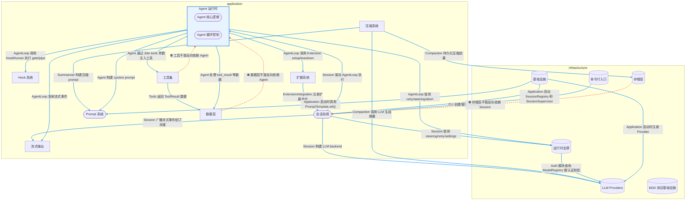
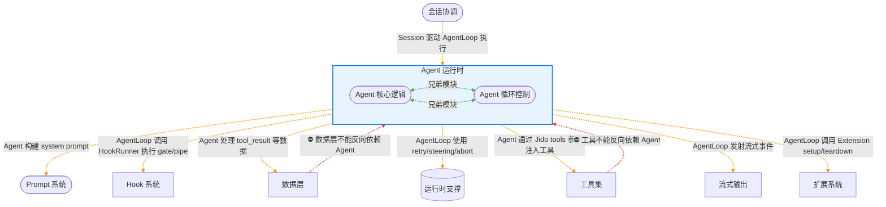

# Gong 架构依赖图 (seed-v4)

> 由 `bcc arch export-mermaid --seed-file seed-v4.yaml` 自动生成

- 节点形状：`([圆角])` = core, `[方框]` = support, `[(圆柱)]` = generic
- 边颜色：🔵 蓝色 = 允许依赖, 🟠 橙色 = 继承依赖, 🟢 绿色 = 兄弟模块, 🔴 红色 = 禁止依赖
- 边标注：中文说明依赖用途（来自 seed 的 rationale 字段）
- 分组：按 layer 分 subgraph，子模块嵌套在父模块内（蓝色边框高亮）

## 总览图（父/顶层模块）

## Agent 运行时 子模块详情

