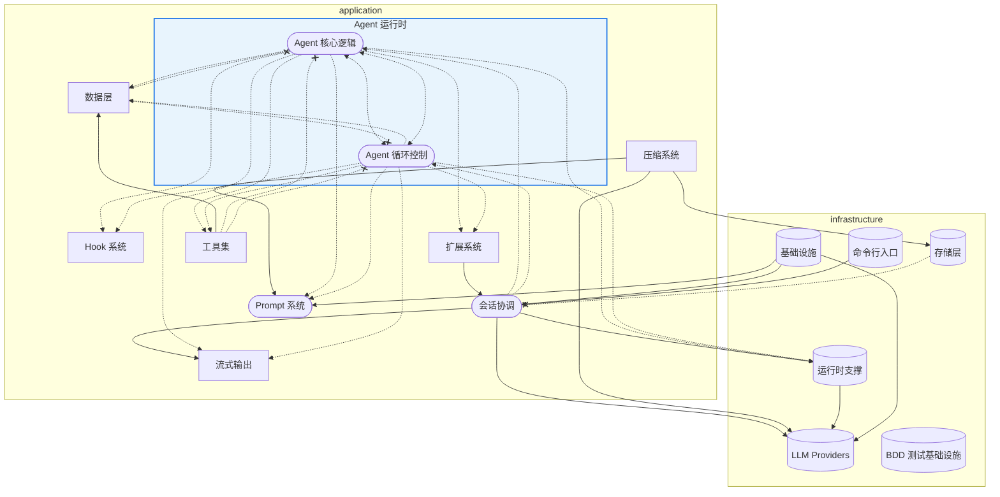

# Gong 架构依赖图 (seed-v4)

> 由 `bcc arch export-mermaid --seed-file seed-v4.yaml` 自动生成

- 节点形状：`([圆角])` = core, `[方框]` = support, `[(圆柱)]` = generic
- 边样式：`-->` = 显式 allowed, `-.->` = 继承 allowed, `<-.->` = 兄弟模块, `-.-x` = forbidden
- 分组：按 layer 分 subgraph，子模块嵌套在父模块内（蓝色边框高亮）

