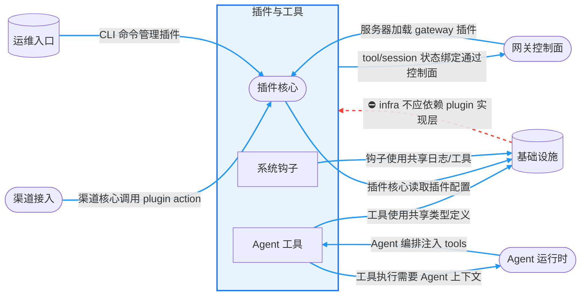
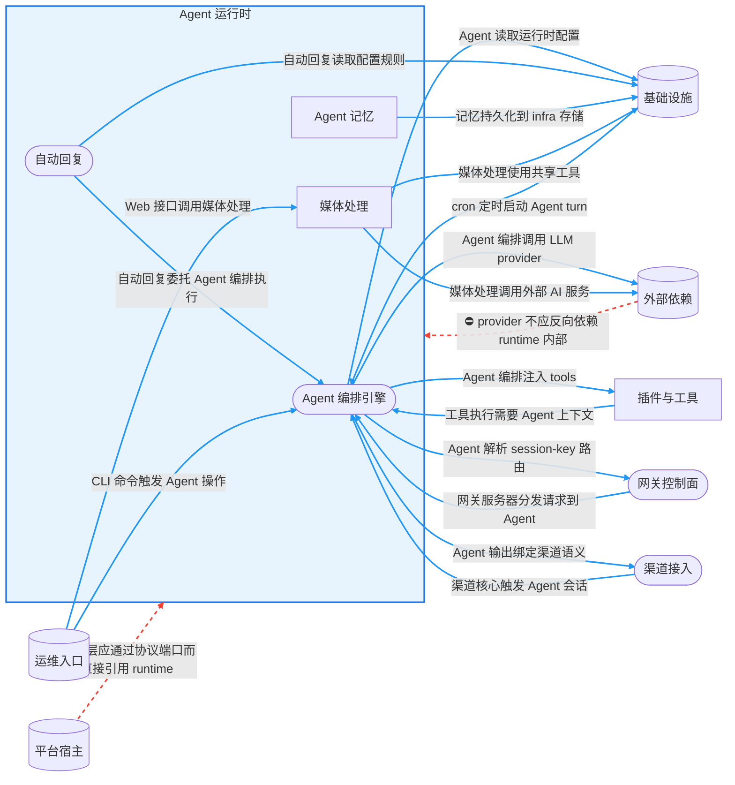

# OpenClaw 架构依赖图 - 插件与工具 / Agent 运行时 详情

> 从 [v2.seed.mermaid.md](./v2.seed.mermaid.md) 拆分，这两个图边数较多，单独文件渲染

## 插件与工具 子模块详情

```mermaid
graph LR
  subgraph plugin_tool_extension["插件与工具"]
    plugin_core(["插件核心"])
    agent_tools["Agent 工具"]
    system_hooks["系统钩子"]
  end
  style plugin_tool_extension fill:#e8f4fd,stroke:#1a73e8,stroke-width:2px,stroke-dasharray:none
  agent_runtime(["Agent 运行时"])
  channel_ingress(["渠道接入"])
  foundation_infra[("基础设施")]
  gateway_control_plane(["网关控制面"])
  ops_client_entry[("运维入口")]

  plugin_tool_extension -->|"tool/session 状态绑定通过控制面"| gateway_control_plane
  agent_runtime -->|"Agent 编排注入 tools"| agent_tools
  gateway_control_plane -->|"服务器加载 gateway 插件"| plugin_core
  channel_ingress -->|"渠道核心调用 plugin action"| plugin_core
  agent_tools -->|"工具执行需要 Agent 上下文"| agent_runtime
  agent_tools -->|"工具使用共享类型定义"| foundation_infra
  plugin_core -->|"插件核心读取插件配置"| foundation_infra
  system_hooks -->|"钩子使用共享日志/工具"| foundation_infra
  ops_client_entry -->|"CLI 命令管理插件"| plugin_core
  foundation_infra -.->|"⛔ infra 不应依赖 plugin 实现层"| plugin_tool_extension
  linkStyle 0,1,2,3,4,5,6,7,8 stroke:#2196F3,stroke-width:2px
  linkStyle 9 stroke:#F44336,stroke-width:2px,stroke-dasharray:5
```

## Agent 运行时 子模块详情

```mermaid
graph LR
  subgraph agent_runtime["Agent 运行时"]
    agent_core(["Agent 编排引擎"])
    auto_reply(["自动回复"])
    agent_memory["Agent 记忆"]
    media_processing["媒体处理"]
  end
  style agent_runtime fill:#e8f4fd,stroke:#1a73e8,stroke-width:2px,stroke-dasharray:none
  channel_ingress(["渠道接入"])
  external_dependencies[("外部依赖")]
  foundation_infra[("基础设施")]
  gateway_control_plane(["网关控制面"])
  ops_client_entry[("运维入口")]
  platform_hosts[("平台宿主")]
  plugin_tool_extension["插件与工具"]

  agent_core -->|"Agent 编排调用 LLM provider"| external_dependencies
  agent_core -->|"Agent 读取运行时配置"| foundation_infra
  agent_core -->|"Agent 编排注入 tools"| plugin_tool_extension
  agent_core -->|"Agent 解析 session-key 路由"| gateway_control_plane
  agent_core -->|"Agent 输出绑定渠道语义"| channel_ingress
  auto_reply -->|"自动回复读取配置规则"| foundation_infra
  auto_reply -->|"自动回复委托 Agent 编排执行"| agent_core
  agent_memory -->|"记忆持久化到 infra 存储"| foundation_infra
  media_processing -->|"媒体处理调用外部 AI 服务"| external_dependencies
  media_processing -->|"媒体处理使用共享工具"| foundation_infra
  gateway_control_plane -->|"网关服务器分发请求到 Agent"| agent_core
  channel_ingress -->|"渠道核心触发 Agent 会话"| agent_core
  foundation_infra -->|"cron 定时启动 Agent turn"| agent_core
  plugin_tool_extension -->|"工具执行需要 Agent 上下文"| agent_core
  ops_client_entry -->|"CLI 命令触发 Agent 操作"| agent_core
  ops_client_entry -->|"Web 接口调用媒体处理"| media_processing
  external_dependencies -.->|"⛔ provider 不应反向依赖 runtime 内部"| agent_runtime
  platform_hosts -.->|"⛔ host 层应通过协议端口而非直接引用 runtime"| agent_runtime
  linkStyle 0,1,2,3,4,5,6,7,8,9,10,11,12,13,14,15 stroke:#2196F3,stroke-width:2px
  linkStyle 16,17 stroke:#F44336,stroke-width:2px,stroke-dasharray:5
```
