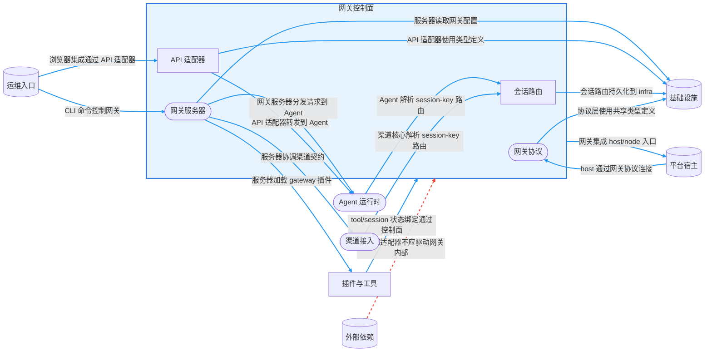
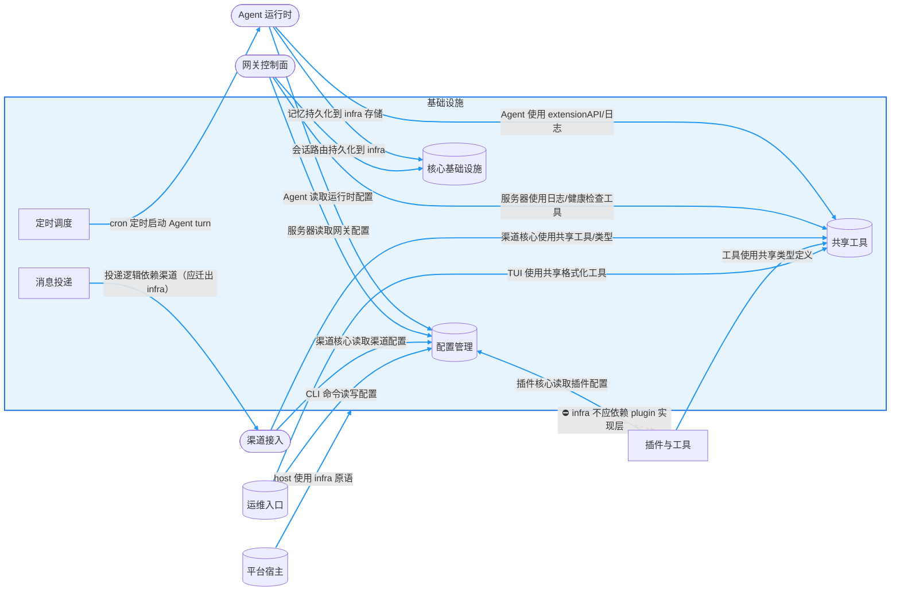

# 架构依赖图 - 网关控制面 / Agent 运行时 / 基础设施 详情

> 从 [v2.seed.mermaid.md](./v2.seed.mermaid.md) 拆分，这些图边数较多（>15 条边），单独文件渲染

## 网关控制面 子模块详情

```mermaid
graph LR
  subgraph gateway_control_plane["网关控制面"]
    gateway_protocol(["网关协议"])
    gateway_server(["网关服务器"])
    gateway_api_adapters["API 适配器"]
    gateway_session_routing["会话路由"]
  end
  style gateway_control_plane fill:#e8f4fd,stroke:#1a73e8,stroke-width:2px,stroke-dasharray:none
  agent_runtime(["Agent 运行时"])
  channel_ingress(["渠道接入"])
  external_dependencies[("外部依赖")]
  foundation_infra[("基础设施")]
  ops_client_entry[("运维入口")]
  platform_hosts[("平台宿主")]
  plugin_tool_extension["插件与工具"]

  gateway_control_plane -->|"网关集成 host/node 入口"| platform_hosts
  plugin_tool_extension -->|"tool/session 状态绑定通过控制面"| gateway_control_plane
  agent_runtime -->|"Agent 解析 session-key 路由"| gateway_session_routing
  gateway_server -->|"网关服务器分发请求到 Agent"| agent_runtime
  gateway_server -->|"服务器读取网关配置"| foundation_infra
  gateway_server -->|"服务器加载 gateway 插件"| plugin_tool_extension
  gateway_server -->|"服务器协调渠道契约"| channel_ingress
  gateway_api_adapters -->|"API 适配器转发到 Agent"| agent_runtime
  gateway_api_adapters -->|"API 适配器使用类型定义"| foundation_infra
  gateway_session_routing -->|"会话路由持久化到 infra"| foundation_infra
  gateway_protocol -->|"协议层使用共享类型定义"| foundation_infra
  platform_hosts -->|"host 通过网关协议连接"| gateway_protocol
  channel_ingress -->|"渠道核心解析 session-key 路由"| gateway_session_routing
  ops_client_entry -->|"CLI 命令控制网关"| gateway_server
  ops_client_entry -->|"浏览器集成通过 API 适配器"| gateway_api_adapters
  external_dependencies -.->|"⛔ 外部适配器不应驱动网关内部"| gateway_control_plane
  linkStyle 0,1,2,3,4,5,6,7,8,9,10,11,12,13,14 stroke:#2196F3,stroke-width:2px
  linkStyle 15 stroke:#F44336,stroke-width:2px,stroke-dasharray:5

```

## Agent 运行时 子模块详情

```mermaid
graph LR
  subgraph agent_runtime["Agent 运行时"]
    agent_core(["Agent 编排引擎"])
    auto_reply(["自动回复"])
    agent_memory["Agent 记忆"]
    media_processing["媒体处理"]
  end
  style agent_runtime fill:#e8f4fd,stroke:#1a73e8,stroke-width:2px,stroke-dasharray:none
  channel_ingress(["渠道接入"])
  external_dependencies[("外部依赖")]
  foundation_infra[("基础设施")]
  gateway_control_plane(["网关控制面"])
  ops_client_entry[("运维入口")]
  platform_hosts[("平台宿主")]
  plugin_tool_extension["插件与工具"]

  agent_core -->|"Agent 编排调用 LLM provider"| external_dependencies
  agent_core -->|"Agent 读取运行时配置"| foundation_infra
  agent_core -->|"Agent 编排注入 tools"| plugin_tool_extension
  agent_core -->|"Agent 解析 session-key 路由"| gateway_control_plane
  agent_core -->|"Agent 输出绑定渠道语义"| channel_ingress
  auto_reply -->|"自动回复读取配置规则"| foundation_infra
  auto_reply -->|"自动回复委托 Agent 编排执行"| agent_core
  agent_memory -->|"记忆持久化到 infra 存储"| foundation_infra
  media_processing -->|"媒体处理调用外部 AI 服务"| external_dependencies
  media_processing -->|"媒体处理使用共享工具"| foundation_infra
  gateway_control_plane -->|"网关服务器分发请求到 Agent"| agent_core
  channel_ingress -->|"渠道核心触发 Agent 会话"| agent_core
  foundation_infra -->|"cron 定时启动 Agent turn"| agent_core
  plugin_tool_extension -->|"工具执行需要 Agent 上下文"| agent_core
  ops_client_entry -->|"CLI 命令触发 Agent 操作"| agent_core
  ops_client_entry -->|"Web 接口调用媒体处理"| media_processing
  external_dependencies -.->|"⛔ provider 不应反向依赖 runtime 内部"| agent_runtime
  platform_hosts -.->|"⛔ host 层应通过协议端口而非直接引用 runtime"| agent_runtime
  linkStyle 0,1,2,3,4,5,6,7,8,9,10,11,12,13,14,15 stroke:#2196F3,stroke-width:2px
  linkStyle 16,17 stroke:#F44336,stroke-width:2px,stroke-dasharray:5

```

## 基础设施 子模块详情

```mermaid
graph LR
  subgraph foundation_infra["基础设施"]
    infra_config[("配置管理")]
    infra_core[("核心基础设施")]
    infra_outbound["消息投递"]
    infra_scheduler["定时调度"]
    infra_shared[("共享工具")]
  end
  style foundation_infra fill:#e8f4fd,stroke:#1a73e8,stroke-width:2px,stroke-dasharray:none
  agent_runtime(["Agent 运行时"])
  channel_ingress(["渠道接入"])
  gateway_control_plane(["网关控制面"])
  ops_client_entry[("运维入口")]
  platform_hosts[("平台宿主")]
  plugin_tool_extension["插件与工具"]

  platform_hosts -->|"host 使用 infra 原语"| foundation_infra
  agent_runtime -->|"Agent 读取运行时配置"| infra_config
  agent_runtime -->|"Agent 使用 extensionAPI/日志"| infra_shared
  agent_runtime -->|"记忆持久化到 infra 存储"| infra_core
  infra_scheduler -->|"cron 定时启动 Agent turn"| agent_runtime
  gateway_control_plane -->|"服务器读取网关配置"| infra_config
  gateway_control_plane -->|"服务器使用日志/健康检查工具"| infra_shared
  gateway_control_plane -->|"会话路由持久化到 infra"| infra_core
  channel_ingress -->|"渠道核心读取渠道配置"| infra_config
  channel_ingress -->|"渠道核心使用共享工具/类型"| infra_shared
  plugin_tool_extension -->|"工具使用共享类型定义"| infra_shared
  plugin_tool_extension -->|"插件核心读取插件配置"| infra_config
  infra_outbound -->|"投递逻辑依赖渠道（应迁出 infra）"| channel_ingress
  ops_client_entry -->|"CLI 命令读写配置"| infra_config
  ops_client_entry -->|"TUI 使用共享格式化工具"| infra_shared
  foundation_infra -.->|"⛔ infra 不应依赖 plugin 实现层"| plugin_tool_extension
  linkStyle 0,1,2,3,4,5,6,7,8,9,10,11,12,13,14 stroke:#2196F3,stroke-width:2px
  linkStyle 15 stroke:#F44336,stroke-width:2px,stroke-dasharray:5

```
