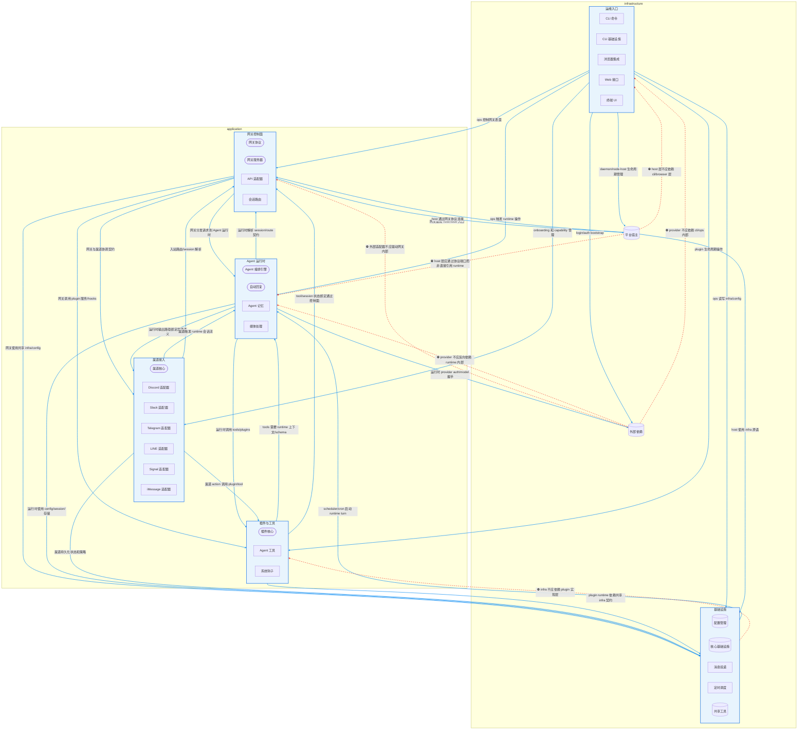

# OpenClaw 架构依赖图 (seed-v2)

> 由 `bcc arch export-mermaid --seed-file v2.seed.yaml` 自动生成

- 节点形状：`([圆角])` = core, `[方框]` = support, `[(圆柱)]` = generic
- 边颜色：🔵 蓝色 = 允许依赖, 🟠 橙色 = 继承依赖, 🟢 绿色 = 兄弟模块, 🔴 红色 = 禁止依赖
- 边标注：中文说明依赖用途（来自 seed 的 rationale 字段）

## 总览图（父/顶层模块）

## 基础设施 子模块详情

```mermaid
graph TD
  subgraph foundation_infra["基础设施"]
    infra_config[("配置管理")]
    infra_core[("核心基础设施")]
    infra_outbound["消息投递"]
    infra_scheduler["定时调度"]
    infra_shared[("共享工具")]
  end
  style foundation_infra fill:#e8f4fd,stroke:#1a73e8,stroke-width:2px,stroke-dasharray:none
  agent_core(["Agent 编排引擎"])
  agent_memory["Agent 记忆"]
  agent_runtime(["Agent 运行时"])
  agent_tools["Agent 工具"]
  auto_reply(["自动回复"])
  channel_core(["渠道核心"])
  channel_discord["Discord 适配器"]
  channel_imessage["iMessage 适配器"]
  channel_ingress(["渠道接入"])
  channel_line["LINE 适配器"]
  channel_signal["Signal 适配器"]
  channel_slack["Slack 适配器"]
  channel_telegram["Telegram 适配器"]
  gateway_api_adapters["API 适配器"]
  gateway_control_plane(["网关控制面"])
  gateway_protocol(["网关协议"])
  gateway_server(["网关服务器"])
  gateway_session_routing["会话路由"]
  media_processing["媒体处理"]
  ops_browser["浏览器集成"]
  ops_cli["CLI 基础设施"]
  ops_client_entry[("运维入口")]
  ops_commands["CLI 命令"]
  ops_tui["终端 UI"]
  ops_web["Web 接口"]
  platform_hosts[("平台宿主")]
  plugin_core(["插件核心"])
  plugin_tool_extension["插件与工具"]
  system_hooks["系统钩子"]

  foundation_infra -.-> agent_memory
  foundation_infra -.->|"scheduler/cron 启动 runtime turn"| agent_runtime
  foundation_infra -.-> auto_reply
  foundation_infra -.-> agent_core
  foundation_infra -.-> media_processing
  agent_memory -.-> foundation_infra
  ops_commands -.-> foundation_infra
  ops_browser -.-> foundation_infra
  ops_tui -.-> foundation_infra
  channel_slack -.-> foundation_infra
  agent_runtime -.->|"运行时使用 config/session/存储"| foundation_infra
  agent_tools -.-> foundation_infra
  channel_signal -.-> foundation_infra
  ops_cli -.-> foundation_infra
  channel_core -.-> foundation_infra
  channel_line -.-> foundation_infra
  media_processing -.-> foundation_infra
  channel_telegram -.-> foundation_infra
  gateway_server -.-> foundation_infra
  channel_ingress -.->|"渠道持久化状态和策略"| foundation_infra
  plugin_core -.-> foundation_infra
  agent_core -.-> foundation_infra
  ops_web -.-> foundation_infra
  gateway_protocol -.-> foundation_infra
  gateway_api_adapters -.-> foundation_infra
  platform_hosts -.->|"host 使用 infra 原语"| foundation_infra
  plugin_tool_extension -.->|"plugin runtime 依赖共享 infra 契约"| foundation_infra
  channel_imessage -.-> foundation_infra
  gateway_control_plane -.->|"网关使用共享 infra/config"| foundation_infra
  system_hooks -.-> foundation_infra
  channel_discord -.-> foundation_infra
  ops_client_entry -.->|"ops 读写 infra/config"| foundation_infra
  auto_reply -.-> foundation_infra
  gateway_session_routing -.-> foundation_infra
  infra_config <-.->|"兄弟模块"| infra_core
  infra_config <-.->|"兄弟模块"| infra_outbound
  infra_config <-.->|"兄弟模块"| infra_scheduler
  infra_config <-.->|"兄弟模块"| infra_shared
  infra_core <-.->|"兄弟模块"| infra_config
  infra_core <-.->|"兄弟模块"| infra_outbound
  infra_core <-.->|"兄弟模块"| infra_scheduler
  infra_core <-.->|"兄弟模块"| infra_shared
  infra_outbound <-.->|"兄弟模块"| infra_config
  infra_outbound <-.->|"兄弟模块"| infra_core
  infra_outbound <-.->|"兄弟模块"| infra_scheduler
  infra_outbound <-.->|"兄弟模块"| infra_shared
  infra_scheduler <-.->|"兄弟模块"| infra_config
  infra_scheduler <-.->|"兄弟模块"| infra_core
  infra_scheduler <-.->|"兄弟模块"| infra_outbound
  infra_scheduler <-.->|"兄弟模块"| infra_shared
  infra_shared <-.->|"兄弟模块"| infra_config
  infra_shared <-.->|"兄弟模块"| infra_core
  infra_shared <-.->|"兄弟模块"| infra_outbound
  infra_shared <-.->|"兄弟模块"| infra_scheduler
  plugin_tool_extension -.->|"⛔ infra 不应依赖 plugin 实现层"| foundation_infra
  agent_tools -.-x foundation_infra
  system_hooks -.-x foundation_infra
  plugin_core -.-x foundation_infra
  linkStyle 0,1,2,3,4,5,6,7,8,9,10,11,12,13,14,15,16,17,18,19,20,21,22,23,24,25,26,27,28,29,30,31,32,33 stroke:#FF9800,stroke-width:2px
  linkStyle 34,35,36,37,38,39,40,41,42,43,44,45,46,47,48,49,50,51,52,53 stroke:#4CAF50,stroke-width:2px
  linkStyle 54,55,56,57 stroke:#F44336,stroke-width:2px
```

## 运维入口 子模块详情

```mermaid
graph TD
  subgraph ops_client_entry["运维入口"]
    ops_commands["CLI 命令"]
    ops_cli["CLI 基础设施"]
    ops_browser["浏览器集成"]
    ops_web["Web 接口"]
    ops_tui["终端 UI"]
  end
  style ops_client_entry fill:#e8f4fd,stroke:#1a73e8,stroke-width:2px,stroke-dasharray:none
  agent_core(["Agent 编排引擎"])
  agent_memory["Agent 记忆"]
  agent_runtime(["Agent 运行时"])
  agent_tools["Agent 工具"]
  auto_reply(["自动回复"])
  channel_core(["渠道核心"])
  channel_discord["Discord 适配器"]
  channel_imessage["iMessage 适配器"]
  channel_ingress(["渠道接入"])
  channel_line["LINE 适配器"]
  channel_signal["Signal 适配器"]
  channel_slack["Slack 适配器"]
  channel_telegram["Telegram 适配器"]
  external_dependencies[("外部依赖")]
  foundation_infra[("基础设施")]
  gateway_api_adapters["API 适配器"]
  gateway_control_plane(["网关控制面"])
  gateway_protocol(["网关协议"])
  gateway_server(["网关服务器"])
  gateway_session_routing["会话路由"]
  infra_config[("配置管理")]
  infra_core[("核心基础设施")]
  infra_outbound["消息投递"]
  infra_scheduler["定时调度"]
  infra_shared[("共享工具")]
  media_processing["媒体处理"]
  platform_hosts[("平台宿主")]
  plugin_core(["插件核心"])
  plugin_tool_extension["插件与工具"]
  system_hooks["系统钩子"]

  ops_client_entry -.->|"plugin 生命周期操作"| plugin_tool_extension
  ops_client_entry -.-> plugin_core
  ops_client_entry -.-> system_hooks
  ops_client_entry -.-> infra_shared
  ops_client_entry -.-> agent_memory
  ops_client_entry -.-> channel_slack
  ops_client_entry -.->|"login/auth bootstrap"| external_dependencies
  ops_client_entry -.-> channel_core
  ops_client_entry -.-> channel_imessage
  ops_client_entry -.->|"onboarding 和 capability 管理"| channel_ingress
  ops_client_entry -.-> gateway_api_adapters
  ops_client_entry -.-> channel_signal
  ops_client_entry -.-> channel_discord
  ops_client_entry -.-> gateway_protocol
  ops_client_entry -.->|"ops 触发 runtime 操作"| agent_runtime
  ops_client_entry -.-> media_processing
  ops_client_entry -.-> auto_reply
  ops_client_entry -.-> agent_core
  ops_client_entry -.-> gateway_server
  ops_client_entry -.->|"ops 读写 infra/config"| foundation_infra
  ops_client_entry -.-> channel_line
  ops_client_entry -.-> infra_core
  ops_client_entry -.-> infra_scheduler
  ops_client_entry -.-> infra_config
  ops_client_entry -.-> gateway_session_routing
  ops_client_entry -.-> channel_telegram
  ops_client_entry -.->|"daemon/node-host 生命周期管理"| platform_hosts
  ops_client_entry -.->|"ops 控制网关表面"| gateway_control_plane
  ops_client_entry -.-> infra_outbound
  ops_client_entry -.-> agent_tools
  ops_commands <-.->|"兄弟模块"| ops_cli
  ops_commands <-.->|"兄弟模块"| ops_browser
  ops_commands <-.->|"兄弟模块"| ops_web
  ops_commands <-.->|"兄弟模块"| ops_tui
  ops_cli <-.->|"兄弟模块"| ops_commands
  ops_cli <-.->|"兄弟模块"| ops_browser
  ops_cli <-.->|"兄弟模块"| ops_web
  ops_cli <-.->|"兄弟模块"| ops_tui
  ops_browser <-.->|"兄弟模块"| ops_commands
  ops_browser <-.->|"兄弟模块"| ops_cli
  ops_browser <-.->|"兄弟模块"| ops_web
  ops_browser <-.->|"兄弟模块"| ops_tui
  ops_web <-.->|"兄弟模块"| ops_commands
  ops_web <-.->|"兄弟模块"| ops_cli
  ops_web <-.->|"兄弟模块"| ops_browser
  ops_web <-.->|"兄弟模块"| ops_tui
  ops_tui <-.->|"兄弟模块"| ops_commands
  ops_tui <-.->|"兄弟模块"| ops_cli
  ops_tui <-.->|"兄弟模块"| ops_browser
  ops_tui <-.->|"兄弟模块"| ops_web
  external_dependencies -.->|"⛔ provider 不应依赖 cli/ops 内部"| ops_client_entry
  platform_hosts -.->|"⛔ host 层不应依赖 cli/browser 层"| ops_client_entry
  linkStyle 0,1,2,3,4,5,6,7,8,9,10,11,12,13,14,15,16,17,18,19,20,21,22,23,24,25,26,27,28,29 stroke:#FF9800,stroke-width:2px
  linkStyle 30,31,32,33,34,35,36,37,38,39,40,41,42,43,44,45,46,47,48,49 stroke:#4CAF50,stroke-width:2px
  linkStyle 50,51 stroke:#F44336,stroke-width:2px
```

## Agent 运行时 子模块详情

```mermaid
graph TD
  subgraph agent_runtime["Agent 运行时"]
    agent_core(["Agent 编排引擎"])
    auto_reply(["自动回复"])
    agent_memory["Agent 记忆"]
    media_processing["媒体处理"]
  end
  style agent_runtime fill:#e8f4fd,stroke:#1a73e8,stroke-width:2px,stroke-dasharray:none
  agent_tools["Agent 工具"]
  channel_core(["渠道核心"])
  channel_discord["Discord 适配器"]
  channel_imessage["iMessage 适配器"]
  channel_ingress(["渠道接入"])
  channel_line["LINE 适配器"]
  channel_signal["Signal 适配器"]
  channel_slack["Slack 适配器"]
  channel_telegram["Telegram 适配器"]
  external_dependencies[("外部依赖")]
  foundation_infra[("基础设施")]
  gateway_api_adapters["API 适配器"]
  gateway_control_plane(["网关控制面"])
  gateway_protocol(["网关协议"])
  gateway_server(["网关服务器"])
  gateway_session_routing["会话路由"]
  infra_config[("配置管理")]
  infra_core[("核心基础设施")]
  infra_outbound["消息投递"]
  infra_scheduler["定时调度"]
  infra_shared[("共享工具")]
  ops_browser["浏览器集成"]
  ops_cli["CLI 基础设施"]
  ops_client_entry[("运维入口")]
  ops_commands["CLI 命令"]
  ops_tui["终端 UI"]
  ops_web["Web 接口"]
  platform_hosts[("平台宿主")]
  plugin_core(["插件核心"])
  plugin_tool_extension["插件与工具"]
  system_hooks["系统钩子"]

  agent_runtime -.->|"运行时解析 session/route 契约"| gateway_control_plane
  agent_runtime -.-> channel_core
  agent_runtime -.-> system_hooks
  agent_runtime -.-> channel_line
  agent_runtime -.-> gateway_api_adapters
  agent_runtime -.-> gateway_server
  agent_runtime -.-> infra_outbound
  agent_runtime -.->|"运行时调用 tools/plugins"| plugin_tool_extension
  agent_runtime -.-> agent_tools
  agent_runtime -.-> channel_discord
  agent_runtime -.-> infra_scheduler
  agent_runtime -.-> infra_shared
  agent_runtime -.-> gateway_protocol
  agent_runtime -.-> channel_slack
  agent_runtime -.->|"运行时使用 config/session/存储"| foundation_infra
  agent_runtime -.-> channel_telegram
  agent_runtime -.-> channel_signal
  agent_runtime -.-> infra_core
  agent_runtime -.-> gateway_session_routing
  agent_runtime -.-> plugin_core
  agent_runtime -.->|"运行时 provider auth/model 握手"| external_dependencies
  agent_runtime -.->|"运行时输出路径绑定渠道语义"| channel_ingress
  agent_runtime -.-> infra_config
  agent_runtime -.-> channel_imessage
  ops_web -.-> agent_runtime
  infra_core -.-> agent_runtime
  infra_outbound -.-> agent_runtime
  system_hooks -.-> agent_runtime
  gateway_session_routing -.-> agent_runtime
  infra_scheduler -.-> agent_runtime
  channel_ingress -.->|"渠道触发 runtime 会话流"| agent_runtime
  gateway_protocol -.-> agent_runtime
  plugin_tool_extension -.->|"tools 需要 runtime 上下文/schema"| agent_runtime
  infra_config -.-> agent_runtime
  channel_telegram -.-> agent_runtime
  channel_line -.-> agent_runtime
  plugin_core -.-> agent_runtime
  gateway_api_adapters -.-> agent_runtime
  channel_slack -.-> agent_runtime
  gateway_control_plane -.->|"网关分发请求到 Agent 运行时"| agent_runtime
  channel_core -.-> agent_runtime
  foundation_infra -.->|"scheduler/cron 启动 runtime turn"| agent_runtime
  infra_shared -.-> agent_runtime
  ops_client_entry -.->|"ops 触发 runtime 操作"| agent_runtime
  channel_signal -.-> agent_runtime
  channel_discord -.-> agent_runtime
  channel_imessage -.-> agent_runtime
  ops_browser -.-> agent_runtime
  ops_cli -.-> agent_runtime
  gateway_server -.-> agent_runtime
  agent_tools -.-> agent_runtime
  ops_commands -.-> agent_runtime
  ops_tui -.-> agent_runtime
  agent_core <-.->|"兄弟模块"| auto_reply
  agent_core <-.->|"兄弟模块"| agent_memory
  agent_core <-.->|"兄弟模块"| media_processing
  auto_reply <-.->|"兄弟模块"| agent_core
  auto_reply <-.->|"兄弟模块"| agent_memory
  auto_reply <-.->|"兄弟模块"| media_processing
  agent_memory <-.->|"兄弟模块"| agent_core
  agent_memory <-.->|"兄弟模块"| auto_reply
  agent_memory <-.->|"兄弟模块"| media_processing
  media_processing <-.->|"兄弟模块"| agent_core
  media_processing <-.->|"兄弟模块"| auto_reply
  media_processing <-.->|"兄弟模块"| agent_memory
  external_dependencies -.->|"⛔ provider 不应反向依赖 runtime 内部"| agent_runtime
  platform_hosts -.->|"⛔ host 层应通过协议端口而非直接引用 runtime"| agent_runtime
  linkStyle 0,1,2,3,4,5,6,7,8,9,10,11,12,13,14,15,16,17,18,19,20,21,22,23,24,25,26,27,28,29,30,31,32,33,34,35,36,37,38,39,40,41,42,43,44,45,46,47,48,49,50,51,52 stroke:#FF9800,stroke-width:2px
  linkStyle 53,54,55,56,57,58,59,60,61,62,63,64 stroke:#4CAF50,stroke-width:2px
  linkStyle 65,66 stroke:#F44336,stroke-width:2px
```

## 网关控制面 子模块详情

```mermaid
graph TD
  subgraph gateway_control_plane["网关控制面"]
    gateway_protocol(["网关协议"])
    gateway_server(["网关服务器"])
    gateway_api_adapters["API 适配器"]
    gateway_session_routing["会话路由"]
  end
  style gateway_control_plane fill:#e8f4fd,stroke:#1a73e8,stroke-width:2px,stroke-dasharray:none
  agent_core(["Agent 编排引擎"])
  agent_memory["Agent 记忆"]
  agent_runtime(["Agent 运行时"])
  agent_tools["Agent 工具"]
  auto_reply(["自动回复"])
  channel_core(["渠道核心"])
  channel_discord["Discord 适配器"]
  channel_imessage["iMessage 适配器"]
  channel_ingress(["渠道接入"])
  channel_line["LINE 适配器"]
  channel_signal["Signal 适配器"]
  channel_slack["Slack 适配器"]
  channel_telegram["Telegram 适配器"]
  external_dependencies[("外部依赖")]
  foundation_infra[("基础设施")]
  infra_config[("配置管理")]
  infra_core[("核心基础设施")]
  infra_outbound["消息投递"]
  infra_scheduler["定时调度"]
  infra_shared[("共享工具")]
  media_processing["媒体处理"]
  ops_browser["浏览器集成"]
  ops_cli["CLI 基础设施"]
  ops_client_entry[("运维入口")]
  ops_commands["CLI 命令"]
  ops_tui["终端 UI"]
  ops_web["Web 接口"]
  platform_hosts[("平台宿主")]
  plugin_core(["插件核心"])
  plugin_tool_extension["插件与工具"]
  system_hooks["系统钩子"]

  gateway_control_plane -.-> channel_signal
  gateway_control_plane -.-> infra_shared
  gateway_control_plane -.-> media_processing
  gateway_control_plane -.-> channel_line
  gateway_control_plane -.->|"网关分发请求到 Agent 运行时"| agent_runtime
  gateway_control_plane -.-> agent_tools
  gateway_control_plane -.-> infra_config
  gateway_control_plane -.-> channel_slack
  gateway_control_plane -.-> plugin_core
  gateway_control_plane -.-> infra_core
  gateway_control_plane -.->|"网关与渠道协调契约"| channel_ingress
  gateway_control_plane -.-> channel_core
  gateway_control_plane -.->|"网关集成 host/node 入口"| platform_hosts
  gateway_control_plane -.-> auto_reply
  gateway_control_plane -.-> agent_memory
  gateway_control_plane -.-> channel_telegram
  gateway_control_plane -.-> channel_discord
  gateway_control_plane -.-> infra_outbound
  gateway_control_plane -.-> channel_imessage
  gateway_control_plane -.-> system_hooks
  gateway_control_plane -.->|"网关调用 plugin 服务/hooks"| plugin_tool_extension
  gateway_control_plane -.-> infra_scheduler
  gateway_control_plane -.->|"网关使用共享 infra/config"| foundation_infra
  gateway_control_plane -.-> agent_core
  agent_core -.-> gateway_control_plane
  channel_telegram -.-> gateway_control_plane
  channel_slack -.-> gateway_control_plane
  ops_cli -.-> gateway_control_plane
  agent_tools -.-> gateway_control_plane
  ops_tui -.-> gateway_control_plane
  ops_browser -.-> gateway_control_plane
  channel_discord -.-> gateway_control_plane
  ops_web -.-> gateway_control_plane
  auto_reply -.-> gateway_control_plane
  channel_line -.-> gateway_control_plane
  system_hooks -.-> gateway_control_plane
  channel_imessage -.-> gateway_control_plane
  channel_signal -.-> gateway_control_plane
  agent_runtime -.->|"运行时解析 session/route 契约"| gateway_control_plane
  ops_commands -.-> gateway_control_plane
  plugin_core -.-> gateway_control_plane
  channel_ingress -.->|"入站路由/session 解析"| gateway_control_plane
  channel_core -.-> gateway_control_plane
  ops_client_entry -.->|"ops 控制网关表面"| gateway_control_plane
  plugin_tool_extension -.->|"tool/session 状态绑定通过控制面"| gateway_control_plane
  agent_memory -.-> gateway_control_plane
  platform_hosts -.->|"host 通过网关协议连接"| gateway_control_plane
  media_processing -.-> gateway_control_plane
  gateway_protocol <-.->|"兄弟模块"| gateway_server
  gateway_protocol <-.->|"兄弟模块"| gateway_api_adapters
  gateway_protocol <-.->|"兄弟模块"| gateway_session_routing
  gateway_server <-.->|"兄弟模块"| gateway_protocol
  gateway_server <-.->|"兄弟模块"| gateway_api_adapters
  gateway_server <-.->|"兄弟模块"| gateway_session_routing
  gateway_api_adapters <-.->|"兄弟模块"| gateway_protocol
  gateway_api_adapters <-.->|"兄弟模块"| gateway_server
  gateway_api_adapters <-.->|"兄弟模块"| gateway_session_routing
  gateway_session_routing <-.->|"兄弟模块"| gateway_protocol
  gateway_session_routing <-.->|"兄弟模块"| gateway_server
  gateway_session_routing <-.->|"兄弟模块"| gateway_api_adapters
  external_dependencies -.->|"⛔ 外部适配器不应驱动网关内部"| gateway_control_plane
  linkStyle 0,1,2,3,4,5,6,7,8,9,10,11,12,13,14,15,16,17,18,19,20,21,22,23,24,25,26,27,28,29,30,31,32,33,34,35,36,37,38,39,40,41,42,43,44,45,46,47 stroke:#FF9800,stroke-width:2px
  linkStyle 48,49,50,51,52,53,54,55,56,57,58,59 stroke:#4CAF50,stroke-width:2px
  linkStyle 60 stroke:#F44336,stroke-width:2px
```

## 插件与工具 子模块详情

```mermaid
graph TD
  subgraph plugin_tool_extension["插件与工具"]
    plugin_core(["插件核心"])
    agent_tools["Agent 工具"]
    system_hooks["系统钩子"]
  end
  style plugin_tool_extension fill:#e8f4fd,stroke:#1a73e8,stroke-width:2px,stroke-dasharray:none
  agent_core(["Agent 编排引擎"])
  agent_memory["Agent 记忆"]
  agent_runtime(["Agent 运行时"])
  auto_reply(["自动回复"])
  channel_core(["渠道核心"])
  channel_discord["Discord 适配器"]
  channel_imessage["iMessage 适配器"]
  channel_ingress(["渠道接入"])
  channel_line["LINE 适配器"]
  channel_signal["Signal 适配器"]
  channel_slack["Slack 适配器"]
  channel_telegram["Telegram 适配器"]
  foundation_infra[("基础设施")]
  gateway_api_adapters["API 适配器"]
  gateway_control_plane(["网关控制面"])
  gateway_protocol(["网关协议"])
  gateway_server(["网关服务器"])
  gateway_session_routing["会话路由"]
  infra_config[("配置管理")]
  infra_core[("核心基础设施")]
  infra_outbound["消息投递"]
  infra_scheduler["定时调度"]
  infra_shared[("共享工具")]
  media_processing["媒体处理"]
  ops_browser["浏览器集成"]
  ops_cli["CLI 基础设施"]
  ops_client_entry[("运维入口")]
  ops_commands["CLI 命令"]
  ops_tui["终端 UI"]
  ops_web["Web 接口"]

  plugin_tool_extension -.->|"tools 需要 runtime 上下文/schema"| agent_runtime
  plugin_tool_extension -.-> gateway_server
  plugin_tool_extension -.-> agent_memory
  plugin_tool_extension -.->|"plugin runtime 依赖共享 infra 契约"| foundation_infra
  plugin_tool_extension -.-> auto_reply
  plugin_tool_extension -.-> infra_outbound
  plugin_tool_extension -.-> agent_core
  plugin_tool_extension -.-> infra_shared
  plugin_tool_extension -.->|"tool/session 状态绑定通过控制面"| gateway_control_plane
  plugin_tool_extension -.-> gateway_api_adapters
  plugin_tool_extension -.-> gateway_session_routing
  plugin_tool_extension -.-> infra_core
  plugin_tool_extension -.-> media_processing
  plugin_tool_extension -.-> infra_scheduler
  plugin_tool_extension -.-> infra_config
  plugin_tool_extension -.-> gateway_protocol
  gateway_session_routing -.-> plugin_tool_extension
  ops_browser -.-> plugin_tool_extension
  channel_imessage -.-> plugin_tool_extension
  channel_core -.-> plugin_tool_extension
  channel_ingress -.->|"渠道 action 调用 plugin/tool"| plugin_tool_extension
  gateway_control_plane -.->|"网关调用 plugin 服务/hooks"| plugin_tool_extension
  auto_reply -.-> plugin_tool_extension
  gateway_server -.-> plugin_tool_extension
  channel_signal -.-> plugin_tool_extension
  agent_memory -.-> plugin_tool_extension
  ops_client_entry -.->|"plugin 生命周期操作"| plugin_tool_extension
  agent_core -.-> plugin_tool_extension
  channel_telegram -.-> plugin_tool_extension
  gateway_api_adapters -.-> plugin_tool_extension
  ops_web -.-> plugin_tool_extension
  ops_tui -.-> plugin_tool_extension
  ops_cli -.-> plugin_tool_extension
  channel_line -.-> plugin_tool_extension
  ops_commands -.-> plugin_tool_extension
  media_processing -.-> plugin_tool_extension
  channel_slack -.-> plugin_tool_extension
  agent_runtime -.->|"运行时调用 tools/plugins"| plugin_tool_extension
  gateway_protocol -.-> plugin_tool_extension
  channel_discord -.-> plugin_tool_extension
  plugin_core <-.->|"兄弟模块"| agent_tools
  plugin_core <-.->|"兄弟模块"| system_hooks
  agent_tools <-.->|"兄弟模块"| plugin_core
  agent_tools <-.->|"兄弟模块"| system_hooks
  system_hooks <-.->|"兄弟模块"| plugin_core
  system_hooks <-.->|"兄弟模块"| agent_tools
  infra_shared -.-x plugin_tool_extension
  infra_config -.-x plugin_tool_extension
  foundation_infra -.->|"⛔ infra 不应依赖 plugin 实现层"| plugin_tool_extension
  infra_core -.-x plugin_tool_extension
  infra_scheduler -.-x plugin_tool_extension
  infra_outbound -.-x plugin_tool_extension
  linkStyle 0,1,2,3,4,5,6,7,8,9,10,11,12,13,14,15,16,17,18,19,20,21,22,23,24,25,26,27,28,29,30,31,32,33,34,35,36,37,38,39 stroke:#FF9800,stroke-width:2px
  linkStyle 40,41,42,43,44,45 stroke:#4CAF50,stroke-width:2px
  linkStyle 46,47,48,49,50,51 stroke:#F44336,stroke-width:2px
```

## 渠道接入 子模块详情

```mermaid
graph TD
  subgraph channel_ingress["渠道接入"]
    channel_core(["渠道核心"])
    channel_discord["Discord 适配器"]
    channel_slack["Slack 适配器"]
    channel_telegram["Telegram 适配器"]
    channel_line["LINE 适配器"]
    channel_signal["Signal 适配器"]
    channel_imessage["iMessage 适配器"]
  end
  style channel_ingress fill:#e8f4fd,stroke:#1a73e8,stroke-width:2px,stroke-dasharray:none
  agent_core(["Agent 编排引擎"])
  agent_memory["Agent 记忆"]
  agent_runtime(["Agent 运行时"])
  agent_tools["Agent 工具"]
  auto_reply(["自动回复"])
  foundation_infra[("基础设施")]
  gateway_api_adapters["API 适配器"]
  gateway_control_plane(["网关控制面"])
  gateway_protocol(["网关协议"])
  gateway_server(["网关服务器"])
  gateway_session_routing["会话路由"]
  infra_config[("配置管理")]
  infra_core[("核心基础设施")]
  infra_outbound["消息投递"]
  infra_scheduler["定时调度"]
  infra_shared[("共享工具")]
  media_processing["媒体处理"]
  ops_browser["浏览器集成"]
  ops_cli["CLI 基础设施"]
  ops_client_entry[("运维入口")]
  ops_commands["CLI 命令"]
  ops_tui["终端 UI"]
  ops_web["Web 接口"]
  plugin_core(["插件核心"])
  plugin_tool_extension["插件与工具"]
  system_hooks["系统钩子"]

  channel_ingress -.-> gateway_protocol
  channel_ingress -.-> gateway_server
  channel_ingress -.-> agent_core
  channel_ingress -.-> media_processing
  channel_ingress -.->|"入站路由/session 解析"| gateway_control_plane
  channel_ingress -.-> infra_shared
  channel_ingress -.-> system_hooks
  channel_ingress -.-> infra_scheduler
  channel_ingress -.-> infra_core
  channel_ingress -.-> gateway_api_adapters
  channel_ingress -.-> agent_memory
  channel_ingress -.-> infra_outbound
  channel_ingress -.-> gateway_session_routing
  channel_ingress -.-> plugin_core
  channel_ingress -.->|"渠道触发 runtime 会话流"| agent_runtime
  channel_ingress -.-> agent_tools
  channel_ingress -.-> auto_reply
  channel_ingress -.-> infra_config
  channel_ingress -.->|"渠道 action 调用 plugin/tool"| plugin_tool_extension
  channel_ingress -.->|"渠道持久化状态和策略"| foundation_infra
  ops_commands -.-> channel_ingress
  gateway_session_routing -.-> channel_ingress
  ops_client_entry -.->|"onboarding 和 capability 管理"| channel_ingress
  media_processing -.-> channel_ingress
  agent_core -.-> channel_ingress
  ops_tui -.-> channel_ingress
  gateway_api_adapters -.-> channel_ingress
  ops_cli -.-> channel_ingress
  gateway_control_plane -.->|"网关与渠道协调契约"| channel_ingress
  agent_runtime -.->|"运行时输出路径绑定渠道语义"| channel_ingress
  agent_memory -.-> channel_ingress
  ops_web -.-> channel_ingress
  gateway_server -.-> channel_ingress
  ops_browser -.-> channel_ingress
  gateway_protocol -.-> channel_ingress
  auto_reply -.-> channel_ingress
  channel_core <-.->|"兄弟模块"| channel_discord
  channel_core <-.->|"兄弟模块"| channel_slack
  channel_core <-.->|"兄弟模块"| channel_telegram
  channel_core <-.->|"兄弟模块"| channel_line
  channel_core <-.->|"兄弟模块"| channel_signal
  channel_core <-.->|"兄弟模块"| channel_imessage
  channel_discord <-.->|"兄弟模块"| channel_core
  channel_discord <-.->|"兄弟模块"| channel_slack
  channel_discord <-.->|"兄弟模块"| channel_telegram
  channel_discord <-.->|"兄弟模块"| channel_line
  channel_discord <-.->|"兄弟模块"| channel_signal
  channel_discord <-.->|"兄弟模块"| channel_imessage
  channel_slack <-.->|"兄弟模块"| channel_core
  channel_slack <-.->|"兄弟模块"| channel_discord
  channel_slack <-.->|"兄弟模块"| channel_telegram
  channel_slack <-.->|"兄弟模块"| channel_line
  channel_slack <-.->|"兄弟模块"| channel_signal
  channel_slack <-.->|"兄弟模块"| channel_imessage
  channel_telegram <-.->|"兄弟模块"| channel_core
  channel_telegram <-.->|"兄弟模块"| channel_discord
  channel_telegram <-.->|"兄弟模块"| channel_slack
  channel_telegram <-.->|"兄弟模块"| channel_line
  channel_telegram <-.->|"兄弟模块"| channel_signal
  channel_telegram <-.->|"兄弟模块"| channel_imessage
  channel_line <-.->|"兄弟模块"| channel_core
  channel_line <-.->|"兄弟模块"| channel_discord
  channel_line <-.->|"兄弟模块"| channel_slack
  channel_line <-.->|"兄弟模块"| channel_telegram
  channel_line <-.->|"兄弟模块"| channel_signal
  channel_line <-.->|"兄弟模块"| channel_imessage
  channel_signal <-.->|"兄弟模块"| channel_core
  channel_signal <-.->|"兄弟模块"| channel_discord
  channel_signal <-.->|"兄弟模块"| channel_slack
  channel_signal <-.->|"兄弟模块"| channel_telegram
  channel_signal <-.->|"兄弟模块"| channel_line
  channel_signal <-.->|"兄弟模块"| channel_imessage
  channel_imessage <-.->|"兄弟模块"| channel_core
  channel_imessage <-.->|"兄弟模块"| channel_discord
  channel_imessage <-.->|"兄弟模块"| channel_slack
  channel_imessage <-.->|"兄弟模块"| channel_telegram
  channel_imessage <-.->|"兄弟模块"| channel_line
  channel_imessage <-.->|"兄弟模块"| channel_signal
  linkStyle 0,1,2,3,4,5,6,7,8,9,10,11,12,13,14,15,16,17,18,19,20,21,22,23,24,25,26,27,28,29,30,31,32,33,34,35 stroke:#FF9800,stroke-width:2px
  linkStyle 36,37,38,39,40,41,42,43,44,45,46,47,48,49,50,51,52,53,54,55,56,57,58,59,60,61,62,63,64,65,66,67,68,69,70,71,72,73,74,75,76,77 stroke:#4CAF50,stroke-width:2px
```

