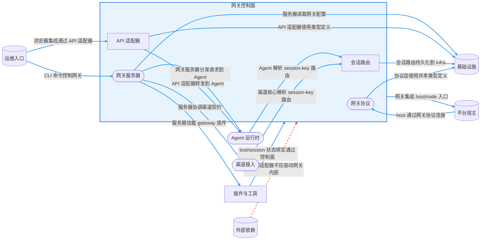
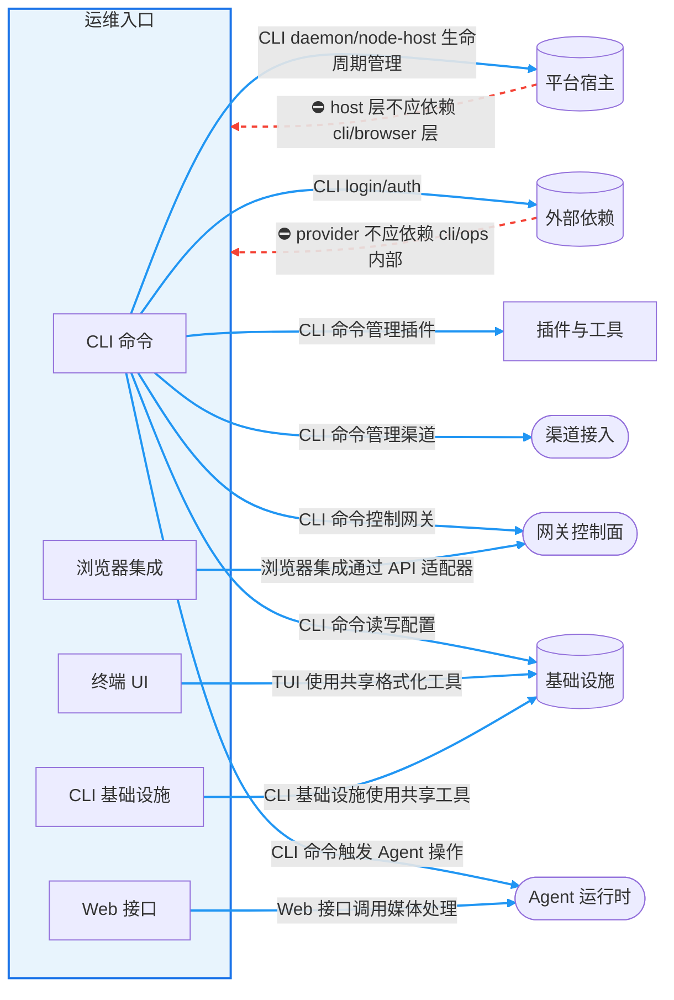
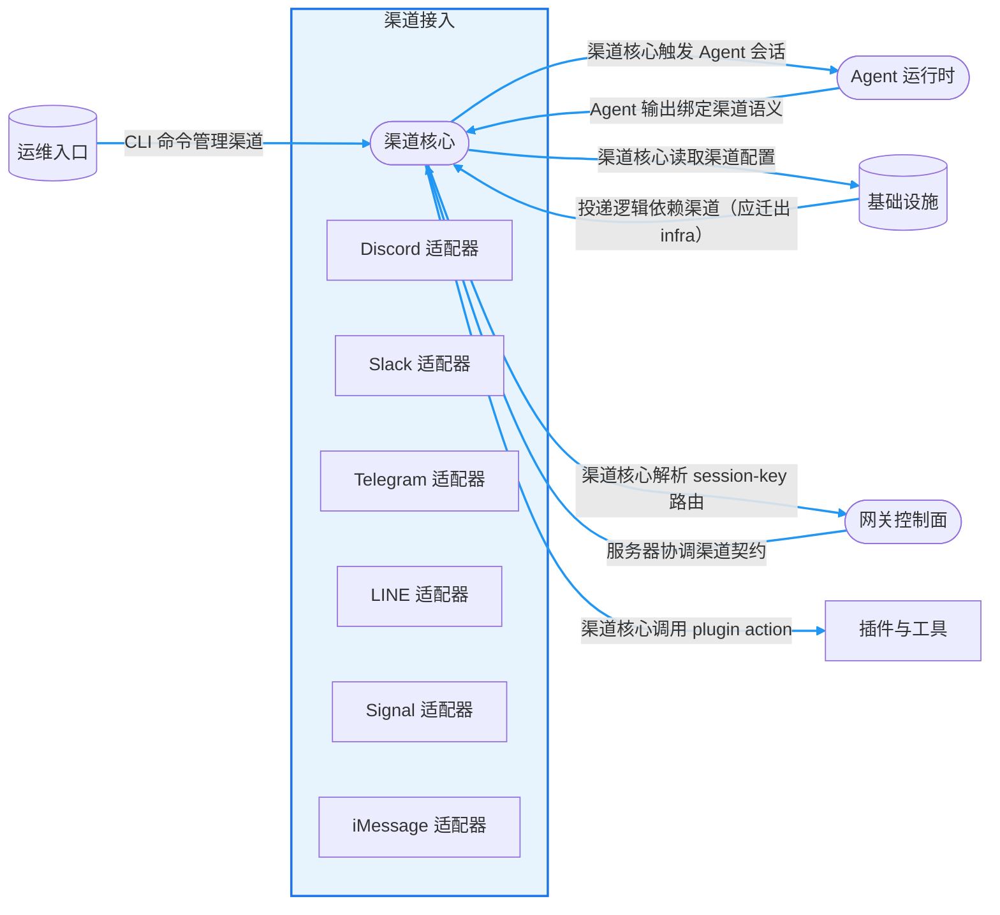
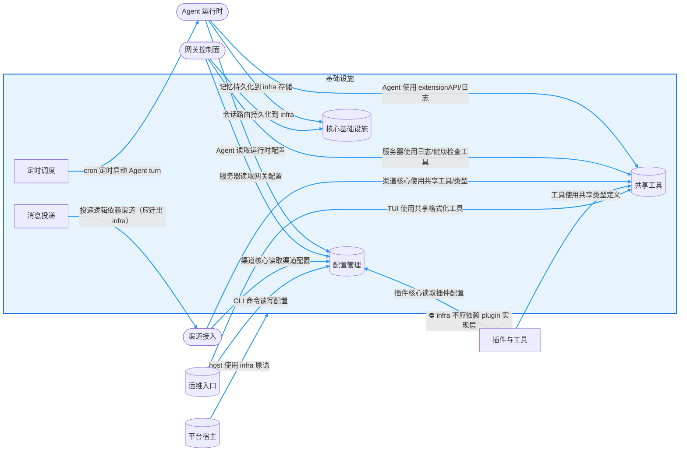

# OpenClaw 架构依赖图 (seed-v2)

> 由 `bcc arch export-mermaid --seed-file v2.seed.yaml` 自动生成

- 节点形状：`([圆角])` = core, `[方框]` = support, `[(圆柱)]` = generic
- 边颜色：🔵 蓝色 = 允许依赖, 🔴 红色 = 禁止依赖
- 边标注：中文说明依赖用途（来自 seed 的 rationale 字段）
- 分组：按 layer 分 subgraph，子模块嵌套在父模块内（蓝色边框高亮）

## 总览图（父/顶层模块）

## 网关控制面 子模块详情

## 运维入口 子模块详情

## 渠道接入 子模块详情

## 基础设施 子模块详情

## 插件与工具 / Agent 运行时 子模块详情

> 这两个图较复杂，单独存放：[v2.seed.mermaid-detail2.md](./v2.seed.mermaid-detail2.md)
